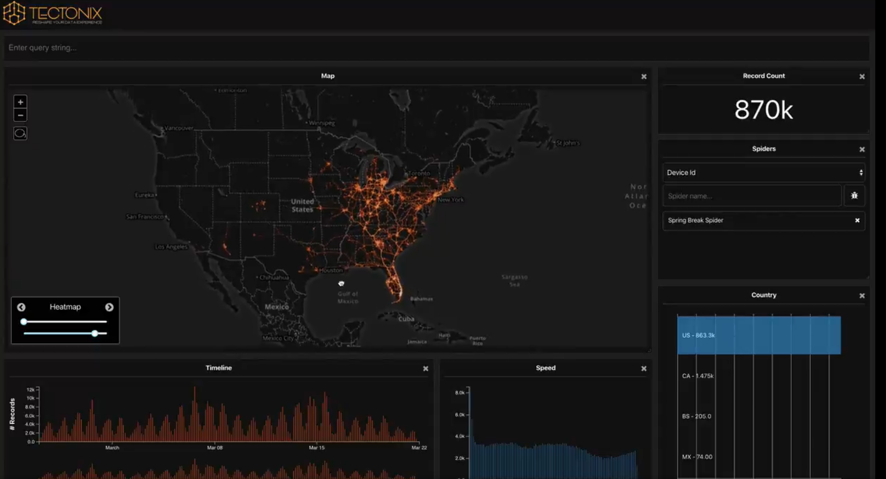
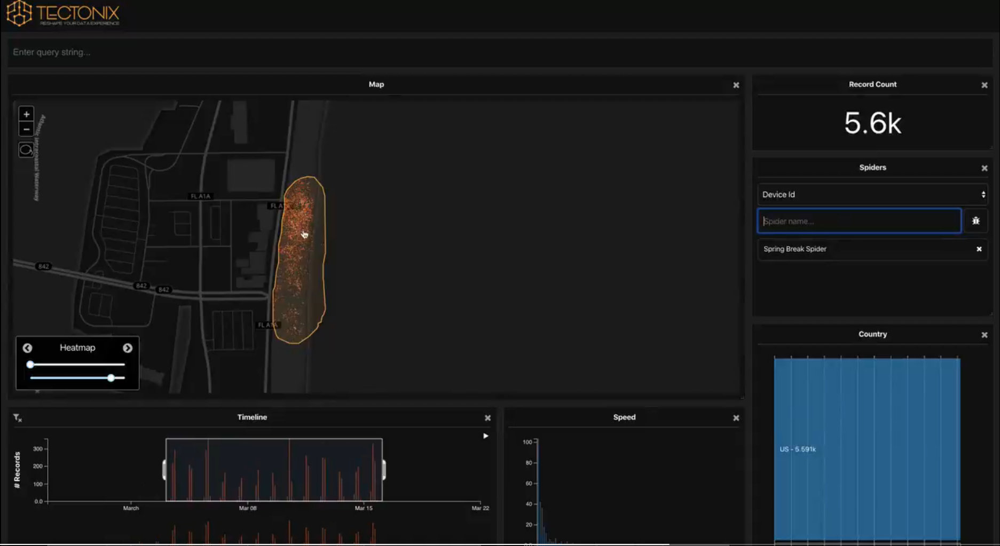

Spring Break - Springbreak Phone Data to Show the Potential Spread of COVID-19
===
By Andrew Nolan (3-22-21)

I was not sure if we needed to submit a reflection this week since it is spring break, but I thought it would be fun to share a cool spring break visualization since it's currently WPI's spring break and starting next week all reflections will be on academic papers.

This article was actually published last year, and it was a bit ahead of it's time. Now we are aware of how dangerous the spread of COVID-19 can be, but last year everything was new. A group of data visualization researchers at Tectonix Geo created a model showing how just the people gathered at one beach in Florida during spring break could spread COVID-19 across the country. They used cell phone data aggregated by the location data company X-Mode Social. This data showed 5000 phones at a beach in Fort Lauderdale Florida during peak Spring break time in March, 2020. Then it zooms out the timeline to see where the phones were the week before and after spring break. This reveals the potential spread that COVID could have from just one beach of spring breakers.

Evidently (and unfortunately), the warnings from Tectonix Geo did not get heard because COVID spread a lot and people are still travelling for spring break this year. But as a data visualization it is very effective at showing how spread can occur. It works as a network showing connections of where the phones travel across the U.S. It ties in niceley with our recent reading of chapter 8 in the text book, since this is a very clear example of arranging spatial data.

Here you can see the collection of 5000 phones without social distance at the beach:

Now you can see the paths these phones have travelled in the dates surrounding the week of spring break:

Sources
---
1. Thousands of spring breakers traveled from one Florida beach to cities across the US. Mapping their phone data shows the importance of social distancing amid the coronavirus outbreak: https://www.businessinsider.com/coronavirus-florida-spring-break-location-data-spread-social-distancing-2020-3
2. Tectonix's Tweet: https://twitter.com/TectonixGEO/status/1242628347034767361?s=20