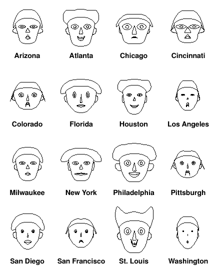
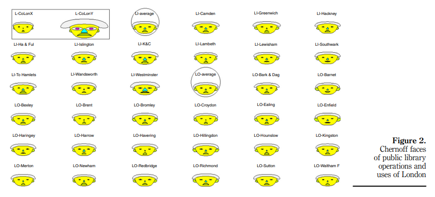
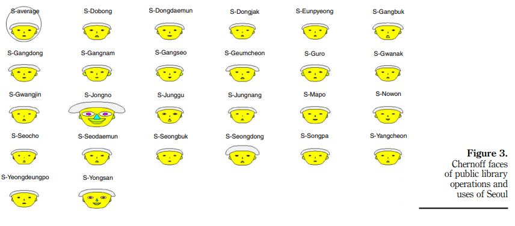
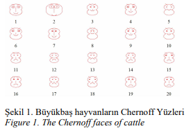
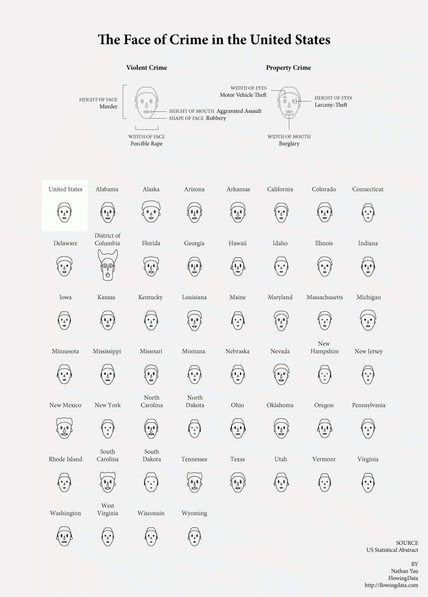

Week 1 - A Discussion of Chernoff Faces
===
By Andrew Nolan (2-8-21)

#### Intro
Last summer I took the course CS 548 Knowledge Discovery and Data Mining. In one of the lectures we talked about data visualizations and in one slide we breifly discussed Chernoff Faces. For some reason I think about this data visualization way more than I should. For my assignment 1 project I made some Chernoff Face visualizations of Iris species data in d3. Since I've been thinking about them all week I felt like an introduction/discussion to the applications of the visualization would be a good choice for this week's reflection.

#### Background

For those unfamiliar with the data vis, Chernoff Faces were invented in 1973 by the American Mathematician, Herman Chernoff. Chernoff Faces provide a way to visualize multivariate data by mapping data features to visual features on the face [1][11]. The benefits of this visualization come from the claim that humans can easily recognize faces and identify small changes between them. This is useful if the goal of the visualization is pattern recognition, outlier detection, or clustering similar data objects. However, the scale and value of data is often obscured by this vis. Without intimate knowledge of which values are mapped to what facial feature it is hard to decipher more than which objects are similar or outliers.

From what I can tell, in most languages you would have to fork someone's Github repo or build your own system for visualizing data with Chernoff Faces. But if you are a fan of R, there is a package called aplpack that includes easy to use Chernoff Face code. This library is commonly used in real world Chernoff Faces. You can see actually see this library in use in all of the examples below. You can learn how to use it in the article "How to Visualize Data with Cartoonish Faces ala Chernoff" [6].

#### Real World Examples

Considering that most people have probably not heard of this visualization, it's unsurprising that it is rarely used for real world applications. However, I wanted to share a few practical examples that could be found.

In 2006 a Social Science Statistics blogger shared a Baseball bloggers Chernoff face represenation of 2005 National League Baseball statistics [4][5]. The faces below map the following features to facial features: 
- Win percent -> face height, smile curve, and hair styling
- Hits -> face width, eye height, and nose height
- Home runs -> face shape, eye width, and nose width
- Walks -> mouth height, hair height, and ear width
- Stolen bases -> mouth width, hair width, and ear height. 

While these statistics may be meaningful, it's hard to determine anything from these faces. In 2005 the winner of the National League was the Houston Astros (who then went on to lose to the White Sox in the World Series). In these faces, Houston doesn't particularly stand out. I'm not knowledgeable enough about baseball to tell you if that means anything, but it appears to me that would mean stand out stats don't neccisarily determine winningness in baseball.

Most Chernoff Face discussion will be from blog posts like the one above, mostly as a for fun look at an obscure data visualization. But there are cases in which Chernoff Faces are used in publishable research. For example, in 2017, the Journal of Documentation published an entry titled "Big data analysis of public library operations and services by using the Chernoff face method" [12]. By using the following feature mapping, the researchers were able to use Chernoff Faces to compare libraries in London and Seoul over time.

- Height of hair -> issues
- Width of hair -> visits
- Eye size -> collections
- Ear size -> number of libraries
- Nose size -> budgets
- Mouth size -> number of staff
- Mouth curvature -> number of professional staff
- Face size -> library floor space

The results of this study were used to compare the libaries. For example, they found London libraries typically had larger budgets than Seoul libraries. And in the time difference they measured (2004-2014) they discovered libaries were shrinking. Specifically related to the data vis, the study determined Chernoff Faces are useful for identifying patterns between libraries. And if a baseline face is set, it can be useful for measuring performance changes overtime. This is actually a very interesting point that is not often seen in Chernoff Faces. The researchers also point out 3 key limitations of Chernoff Faces. They propose that using more than 10 variables in a face will cause result in hard to notice changes. If there are too many faces it can also become hard to remember differences. Finally it is difficult to use to compare datasets that are not normalized. In their case comparing London and Seoul were hard as the different cities reported different data metrics.

Another recently published research example of Chernoff Faces I found comes from cattle research. In 2020, researchers from Akdeniz University in Turkey published a paper titled "Chernoff faces application in livestock" [10]. The paper ananlyzes the theoretical and practical applications of using Chernoff faces to visualize live stock data of cattle and goats. "Easily understood presentations facilitated by figures were obtained." Unfortunately, everything in the paper besides the abstract and image captions are in Turkish, so I don't really know what these faces are saying but we can take their word for it.

To summarize, there are many pratical applications of Chernoff Faces. Although they are rare, there are even more than the ones I've shown here. They are used in all sorts of industries and even used for big data. The primary benefit of this data vis is detecting patterns and outliers in the data.

#### Challenges and Limitations

So far we've mostly looked at successful implementations of Chernoff Faces. But as mentioned in the library paper, Chernoff Faces do have drawbacks. They do not work well with more than 10 variables and if there are too many faces it can become overwhelming. Furthermore, while they are useful for identifying patterns and outliers, they are not as useful for direct comparisons or measuring of values.

In 2007, Robert Kosara, a researcher for Tableau, wrote a blog post describing the drawbacks of Chernoff Faces [2]. His primary criticism serves as a direct counter to the alleged benefit of Chernoff Faces. Chernoff claims faces are a good visualization tool because humans are evolved to recognize faces. Kosara cites papers arguing this is true for faces as a whole and not for individual components. Arguing, "Face perception works in a holistic and hierarchical way. We do not see a nose, ears, eyes, eyebrows, etc., and then piece them together (at least not consciously). Rather, we recognize a person". Arguably, this still allows Chernoff Faces to be a valuable tool for pattern and outlier detection, but further supports the idea that they are not as good for identifying and comparing specific values. 

Expanding on one of the drawbacks discussed in the library paper, Kosara (and the wikipedia article) mentions the importance and limitations of using facial features. In the library article they mention how it is difficult to represent data with more than 10 attributes with a Chernoff Face. Kosara adds onto this mentioning that since certain facial features change more and are easier to recognize, data mapped to these features is percieved as more important. Thus, great care must be taken by data scientists using this visualization to map features appropriately and effectively. 

One last story I thought was interesting and worth discussing in this reflection is about the social implications of Chernoff Faces. Isabella Chua, a data story teller for the Kontinentalist, wrote a blog post discussing the possible accidentally racist nature of some Chernoff Faces [9]. There is a tutorial for how to use Chernoff Faces in R, the same tutorial I mentioned earlier [6]. This tutorial uses United States' crime statistics as its example dataset. The resulting Chernoff Faces can be seen in an image below.

At first glance this seems like standard Chernoff Faces. But as Chua discovered from reading the comments in the tutorial, some unintentional effects occured. Just due to how the R algorithm for Chernoff Faces worked, it mapped high violent crime rates to certain facial features stereotypical of black people. For obvious reasons, this is not a good thing. Chua went on to review her own Chernoff Faces to see if anything similar occured. She discovered that in her own work with Chernoff Faces when representing data from multiple countries, the way the features were chosen had lead to the Chernoff Faces of asian countries having slanted eyes. Another offensive stereotype. She admits in her blog post that she may be looking into it too much. But I believe she raises a good point, with a data vis like Chernoff Faces, or really any data visualization, the way you choose to represent the data tells an important story. We want to convey what the data is telling us and avoid any bias or potentially unintentional offensiveness that the data may create.

#### Concluding Sentence

Sorry for the long reflection this week. I just got really interested in Chernoff Faces and wanted to do a deep dive. I hope this was interesting to anyone who took the time to read it :)

Sources/Further Reading
---
1. Wikipedia https://en.wikipedia.org/wiki/Chernoff_face
2. A Critique of Chernoff Faces https://eagereyes.org/criticism/chernoff-faces
3. Mapping Quality of Life with Chernoff Faces https://web.archive.org/web/20041217153643/http://gis.esri.com/library/userconf/educ04/papers/pap5000.pdf
4. Chernoff Faces (Baseball) https://web.archive.org/web/20130916002111/http://blogs.iq.harvard.edu/sss/archives/2006/11/chernoff_faces_1.shtml
5. What's the Matter With Chernoff Faces? https://web.archive.org/web/20130128144805/http://alexreisner.com/baseball/stats/chernoff
6. How to visualize data with cartoonish faces ala Chernoff https://flowingdata.com/2010/08/31/how-to-visualize-data-with-cartoonish-faces/
7. Chernoff Faces (Crime) https://ldld.samizdat.cc/2016/chernoff-faces/
8. Deep Chernoff Faces https://www.ihatethefuture.com/2020/06/deep-chernoff-faces.html
9. How can a data visualization be racist? https://medium.com/kontinentalist/how-can-a-data-visualisation-be-racist-a652910d8184
10. Chernoff Faces Application in Livestock https://www.cabdirect.org/cabdirect/abstract/20203479862
11. The Use of Faces to Represent
Points in k-Dimensional Space Graphically https://www.jstor.org/stable/2284077
12. Big Data Analysis of Public Library Operations and Services by using the Chernoff Face Method https://www.emerald.com/insight/content/doi/10.1108/JD-08-2016-0098/full/html