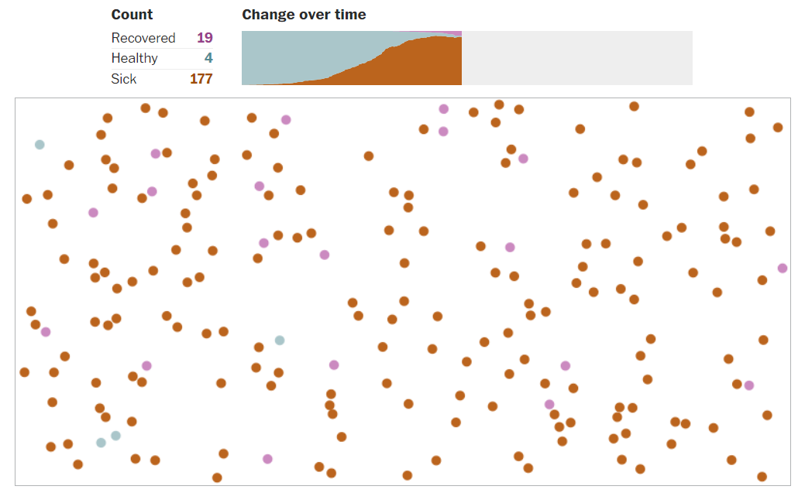
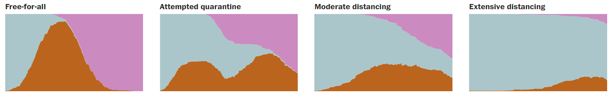

Week 1 Reflection - Why outbreaks like coronavirus spread exponentially, and how to “flatten the curve”
--
The article was posted on The Washington Post on March 14, 2020. [Read the article here.](https://www.washingtonpost.com/graphics/2020/world/corona-simulator/)

While we rallied around flattening the curve, it was clear that a lot of people didn’t know what that actually meant. For The Washington Post, Harry Stevens used a simulation of a simplified version of the virus to demonstrate. The curve became less of an abstract statistical exercise and more of a practical goal.

In the simulator, Harry Stevens uses green dots to represent healthy person, orange dots for sick person, and pink dots for recovered person (as you can see in Picture-1). It helps people figure out what happens by animation in the following four kinds of situation: free-for-all, attempted quarantine, moderate distancing, and extensive distancing. Harry Stevens also provided four charts to show the results of those four situations, as you can see in Picture-2. In conclusion, moderate social distancing will usually outperform the attempted quarantine, and extensive social distancing usually works best of all.

Although this simulator is not high-tech, it is easy to understand, which is very meaningful. It's important to let more people understand why it's better to keep distancing and what will happen if we don't. This simulator can perfectly do this job! From my perspective, data vis is not only about high-tech or fancy things, one goal of data vis should be making people understand data sets better. That's why I choose this article for reflection.

Picture-1

Picture-2

