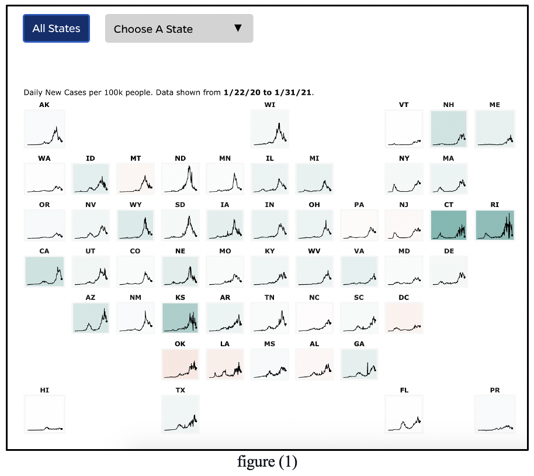
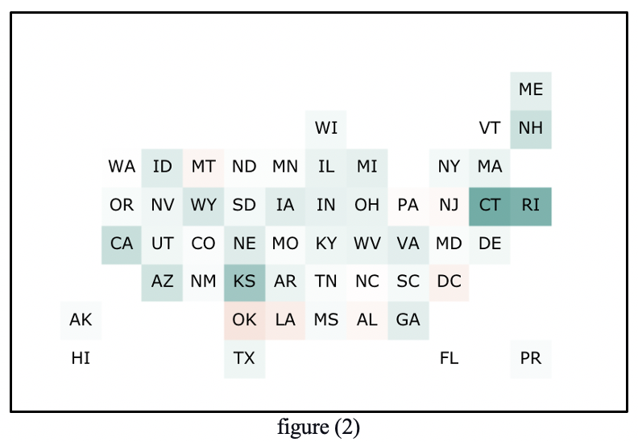
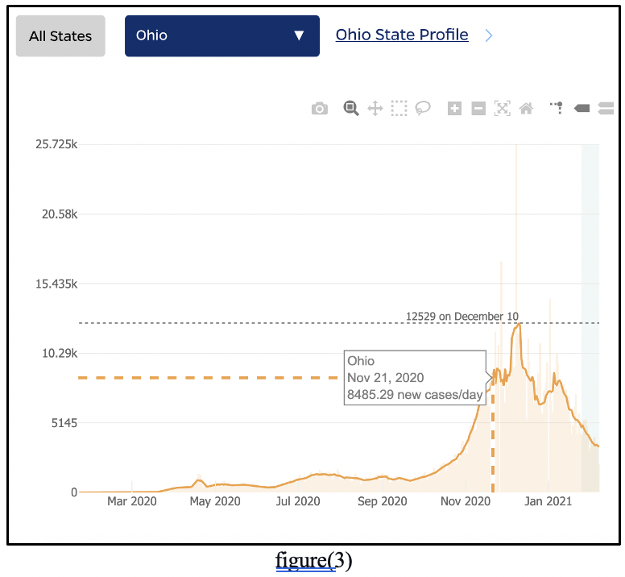
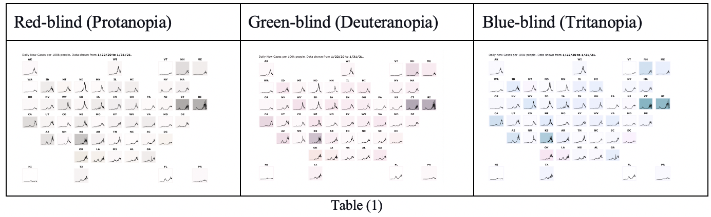

## Week (1) Reflection

**Have we flattened the curve in the US?**

It is a daily tracker to track COVID-19 cases per 100k people to see the trends of the confirmed cases.
The visualization is made by Johns Hopkins University.

  The data is reported in two levels of detail. The first level, shown in figure (1), displays thumbnail charts 
organized in a way that forms the United States map with US State Postal Abbreviations. 
Structuring the thumbnails in this form makes it easy to read more quickly with less eye movement. 
In addition, the color of the thumbnails ranges between white, green, and red. The color choice is consistent 
with the reader's interaction experience where green usually reflects the positive aspect of something 
and the red color reflects the negative one. That gives a general idea about the trends of the confirmed cases 
in a simple and less crowded appearance. 

The map is also responsive, so when reducing the page size, the thumbnails are replaced with squares with the postal 
abbreviations only, as shown in figure (2). When clicking on a specific thumbnail ( or a square) we move to a deeper level
of information, as in figure (3).

   The next level displays a line chart for a certain state with more details. Along with the chart, there are some tools 
that help in the interpretation process such as a tool to compare data on hover, to compare closets data on hover, 
and to zoom in/out. That reinforces controllability and flexibility. Using the tooltip on hover to display more details 
reduces the number of items displayed on the chart which reinforces simplicity.

   In both levels, there are two buttons in the upper left corner of the charts. The first button for displaying the whole map
of thumbnails and the second one to choose a specific state to display with the name of the state written. That speeds up 
the process of finding information about a certain state and reducing the burden of memory.

   In general, the chart is very easy to read and flexible with the reader's preferences. The only thing I would add is making it
  more color-blind friendly and adding a map legend. I have tested the graph by a color-blind simulator [2] and the result 
  is shown in table (1).
  
## Mind Map:

Mind map: https://mm.tt/1775604560?t=7bywBdG9ZO

## Resources:

1)	https://coronavirus.jhu.edu/data/new-cases-50-states/illinois
2)	https://www.color-blindness.com/coblis-color-blindness-simulator/
