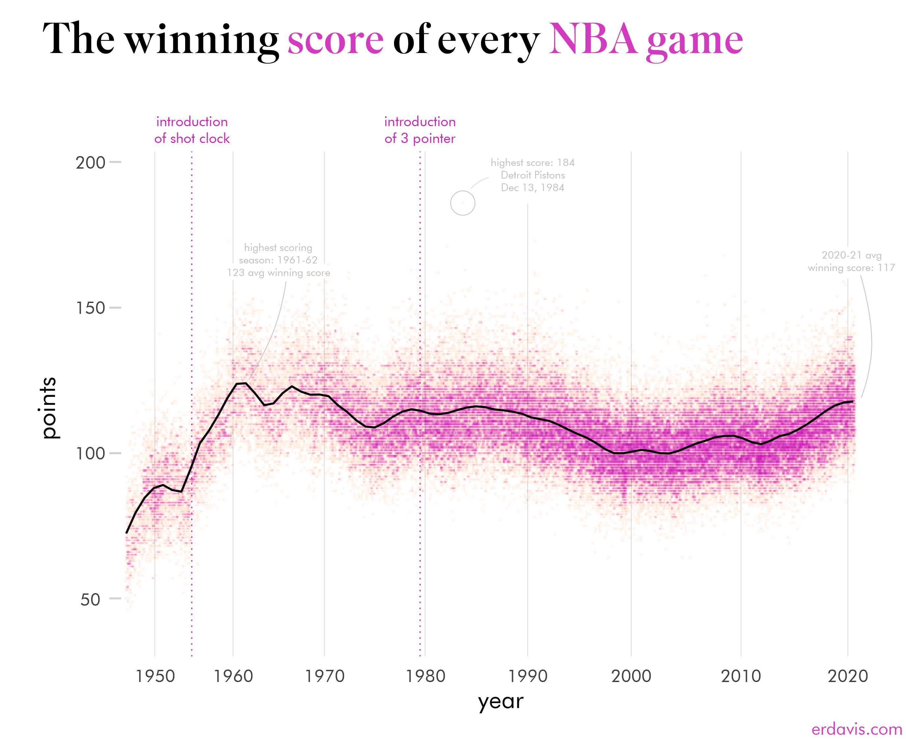

# Week 1 Reflection

Ryan LaMarche

Source: [https://www.reddit.com/r/dataisbeautiful/comments/l8l6di/the_winning_score_of_every_nba_game_oc/](https://www.reddit.com/r/dataisbeautiful/comments/l8l6di/the_winning_score_of_every_nba_game_oc/)

## Reflection

I've browsed /r/dataisbeautiful on reddit before, but mostly just out of interest and not really looking beneath the surface. This is a graph of the winning score of every NBA game, and on the surface level it is a very basic data visualization - a simple scatter plot with a line overlayed to show the average for each season. The part that I think is particularly nice about this graph is the context provided on the time scale with the annotations at the top. There is an annotation around the year 1954 indicating the introduction of the shot clock (forcing players to shoot the ball sooner rather than holding onto it and draining the game clock). This annotation very closely coincides with an increase in game scores for the winning team. Looking at the "Introduction of the 3 pointer" annotation, there did not seem to be much of an impact on the game scores. I also like that they provided a couple of annotations for local maxima in the graph to make it easier to identify outliers, and provided some context as to what the game was and when it happened.

## Takeaways

The big takeaway from this visualization for me is that although most plots and charts have a time axis for data like this, having those few annotations to provide context for the trends in the graph can go a long way for the person who is trying to interpret it. I'd like to find ways to use this technique in some of the visualizations I make for this class throughout the term.
