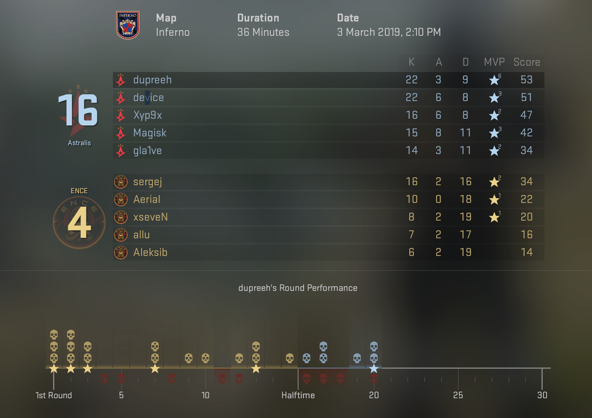
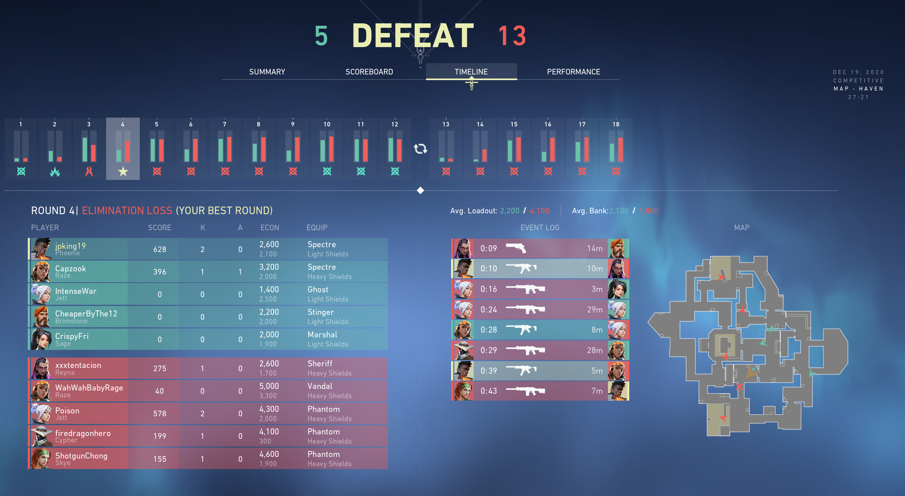

# Reflection - Week 1

## Data Visualization Improvements in First Person Shooters

In this reflection, I am going to cover the impressive progress the video game industry has made in the visualization of player data, specifically concerning two popular team-based First Person Shooters, Counter Strike: Global Offensive (CS:GO) and Valorant.

In both games, players coordinate with teammates to aim to eliminate the other team - but winning a match requires more than good aim. It requires close study of map layout in the rotation, memorization of common sightlines, budgeting your team's economy, and constant analysis of your performance. In a highly competitive experience, players exhibit a natural desire to reflect on their gameplay. The following two pictures examine each game's approach to visualizing a player's experience. It is worth noting that players can watch videos of their matches to analyze performance, and that I will be solely focusing on the data visualizations displayed on the post match screen.

In CS:GO, players can see basic match statistics, such as Kills, Assists and Deaths, for themselves and each other player. The bottom of the screen displays a visualization of each round in the match. Within this, players can see how many eliminations they got in each round, in which rounds they were eliminated, and which rounds their team won/lost. This visualization serves as a condensed timeline of the entire match; at a glance, players can see how they, and their team, performed. However, it does not clarify why they performed well or poorly. Without detailed information on each round, players can all too easily classify a loss as just a "bad game" and lose the opportunity for further analysis.

Valorant also gives player an in depth look at their individual. performance in each of their games. Players have access to a similar scoreboard to Counter Strike's, but more importantly, a round by round break down that attempts to contextualize the basic information offered in CS:GO's visualization. Within each round, a player can see timestamped events listed in the order they occurred. When hovering over one of these events, each player's location at the time of that event is shown on the map. In combination with each round showing which team had advantage in economy, one can highlight player mistakes that changed the momentum of a round, or even the entire match.

There are some areas this visualization could improve. The arrows displayed on the map, meant to represent each player, are not labeled. The map itself could be animated, showing the movement of each player to show the critical seconds before and after an elimination. Regardless, Valorant's round visualization allows players to critically think about their actions, far more than CS:GO's approach. 
