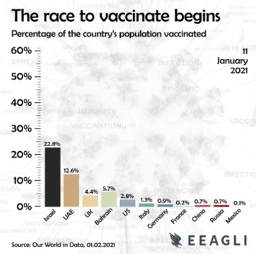

Week 1 Reflection
===

Author
---
Joseph Yuen

References
---
- [r/dataisbeautiful](https://www.reddit.com/r/dataisbeautiful/)
- [*The race to vaccinate begins* - r/dataisbeautiful](https://www.reddit.com/r/dataisbeautiful/comments/ld1h3e/oc_the_race_to_vaccinate_begins/)
- [What do Americans Think of Marjorie Taylor Greene - FiveThirtyEight](https://fivethirtyeight.com/features/what-do-americans-think-of-marjorie-taylor-greene-liz-cheney-josh-hawley/)

Reflection
---
As I am relatively new to the world of data viz, I took this week to explore the various sites recommended by the professor. I started with the sub-reddit r/dataisbeautiful. I scrolled through the various visualizations looking for repeated types of visualizations and common topics. Not to my surprise, there were many visualizations related to COVID-19, the stock market, the superbowl, and US politics. There were also many visualizations about topics such as the vacancy of homes in London and deaths in Sweden which I found to be rather random. I also noticed that the quality of these visualizations varied heavily. Many of the graphs that I saw were confusing and offered little explanation as to why their content was important. However, I found a visualization that I thought was relatively clear to understand. It displayed how much of each country in a set of 11 countries has been vaccinated with a COVID-19 vaccine from December 21, 2020 to February 1, 2021 as seen in the image below. 

Based on what we learned in class, the usage of a bar graph and differing colors significantly impacts the way our eyes see the differences in values. That may explain why I thought the viz was easy to comprehend. In addition, I was drawn to this viz as it actually contained labels for the axis unlike many of the visualizations in r/dataisbeautiful. The viz also was in the form of a video. Although the passage of time is typically displayed in a line graph, this viz used a timestamp in the right top corner that increased overtime dynamically changing the bar graph. This approach may not explicitly show the rate at which vaccines were given to the population, but the 20 second viz video fits the context. On a platform like reddit, users don't typically watch long videos, so the short duration and simplicity of viz is appropriate for the platform.

I also read an article from FiveThirtyEight as the website was recommended by the professor. The article was about the popularity of certain congressional Republicans. In the article, they used a relatively simple table displaying the percentages as seen in the figure below. 

Although the table does communicate the net favor for the survey population, I think that the designers should have ordered the politicians by net favor. The title "These 8 congressional Republicans are pretty unpopular" suggests that the viz is about unpopularity, but the table is ordered by the percentage of people who had an opinion which I think takes away from the main message. Even though I disagree with how the table was ordered, the coloring of the net favor helped me to see what numbers were higher than others.

Overall, I found this week's exploration to be enlightening as I had not previously examined them with the knowledge of best practices.
