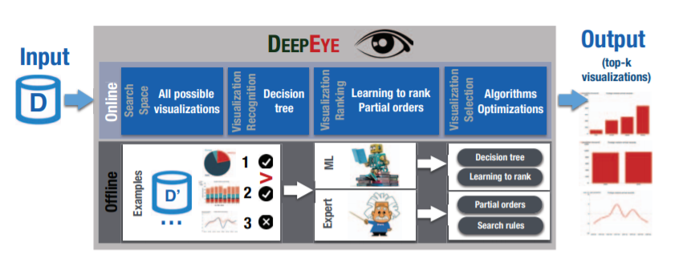
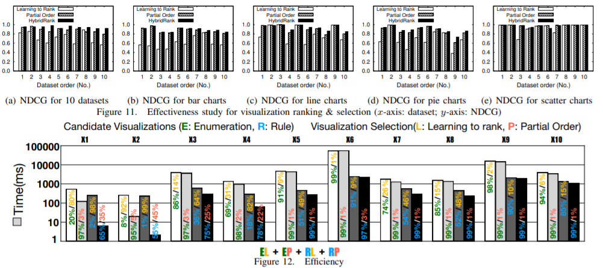

# Week 10 - DeepEye: Towards Automatic Data Visualization

[Paper link](https://ieeexplore.ieee.org/abstract/document/8509240?casa_token=TMV1Y6In2ZsAAAAA:cHflIaZeWi0o74QewH4B5nON8Jsgc_W-G4cwoCHKFQsB8psiqi_bLCHy3PL_xRe4kYi0TT8h)

Authors: 
Yuyu Luo† Xuedi Qin† Nan Tang‡ Guoliang Li†

Abstract:
Data visualization is invaluable for explaining the significance of data to people who are visually oriented. The central task of automatic data visualization is, given a dataset, to visualize its compelling stories by transforming the data (e.g., selecting attributes, grouping and binning values) and deciding the right type of visualization (e.g., bar or line charts). We present DEEPEYE, a novel system for automatic data visualization that tackles three problems: (1) Visualization recognition: given a visualization, is it "good or "bad"? (2) Visualization ranking: given two visualizations, which one is "better"? And (3) Visualization selection: given a dataset, how to find top-k visualizations? DEEPEYE addresses (1) by training a binary classifier to decide whether a particular visualization is good or bad. It solves (2) from two perspectives: (i) Machine learning: it uses a supervised learning-to-rank model to rank visualizations; and (ii) Expert rules: it relies on experts' knowledge to specify partial orders as rules. Moreover, a "boring" dataset may become interesting after data transformations (e.g., binning and grouping), which forms a large search space. We also discuss optimizations to efficiently compute top-k visualizations, for approaching (3). Extensive experiments verify the effectiveness of DEEPEYE".

Nowadays, we have more and more options of visualizations due to a remarkable series of empirical successes both in industry
(e.g., Tableau and Qlik), and in academia a (e.g., DeVIL, ZQL, SeeDB, and zenvisage). But how to choose the best one from multiple options? DeepEye gives us some inspiration of solving the problem by making use of machine learning techniques instead of user research. I think ranking visualizations automatically might become a trend in the future, thus the research in this paper is a good start. But there still lies a lot of challenges in the way, for instance, how to quantify that which visualization is good, better, or the best? In addition, finding good visualizations is a mining task. Unfortunately, a benchmark or the ground truth of a given dataset is often unavailable.

