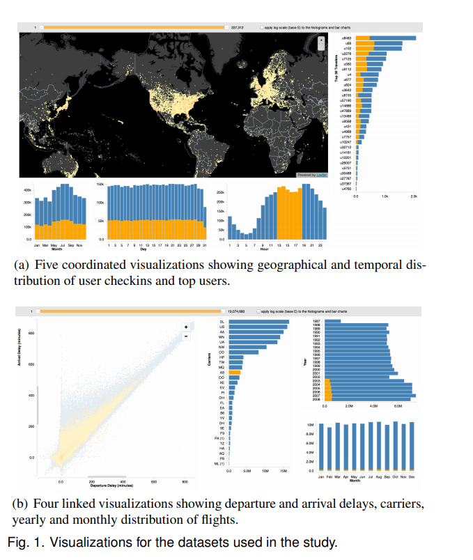
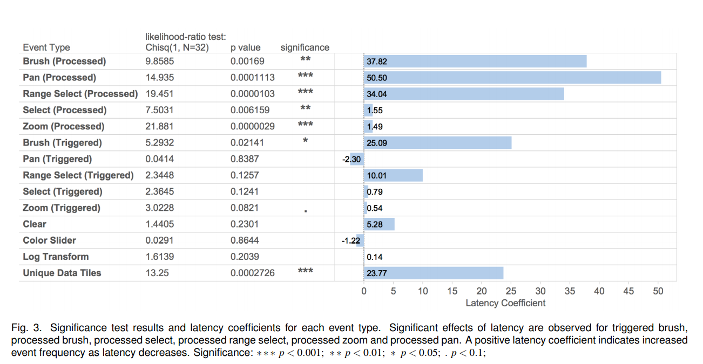

# Week 10 Reflection

## The Effects of Interactive Latency on Exploratory Visual Analysis

This paper investigates the effects of latency in data visualization as it relates to exploratory tasks. They used two different linked visualizations, each with 5 linked components making use of different publicly available datasets. The control of the experiment had negligible latency in the exploratory operations, and the delay condition adding 500ms of delay for brushing linked views, selecting, panning, and zooming. They measured how many exploratory operations/events the user performed and collected verbal "think out loud" data from each participant.

The results indicate that users behave differently and interact differenly with the visualization when there is a high amount of latency for each operation. They refer to this in the paper as "shifting their exploration strategy." However, an interesting find was that this effect was "task dependent," or more accurately dependent on cognitive load. For instance, the difference in behavior is not significant for zooming and panning on a map, likely because users have a higher tolerance for delay in these types of interactions. In contrast, in some actions the user takes, they expect instant gratification and high responsiveness. These are the tasks that are heavily affected by high latency.

### Source

https://idl.cs.washington.edu/files/2014-Latency-InfoVis.pdf
