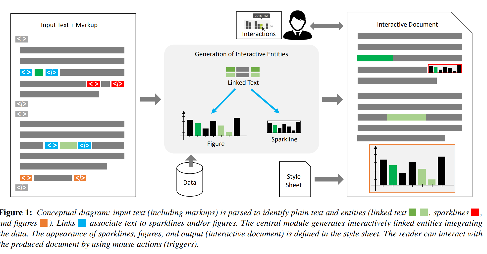
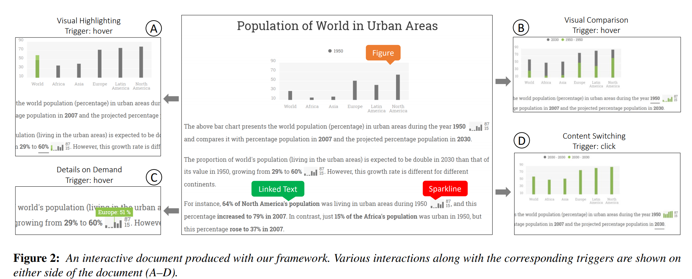

Reflection
====

link:https://diglib.eg.org/bitstream/handle/10.2312/eurovisshort20181084/091-094.pdf    
    
Visualizations can be an augmentation to text in the documents. If readers can interact text, the content will be more intuitive to readers. This paper mainly studies on designing a framework to design text which has interactive link to graphics.    
    
What if text has no interactive link with graphics? Readers need to look back and check the graphics and then back to text. If text has interactive link with graphics, readers don’t need to flip back and forth through the pages to explore the cross references between text and corresponding graphics. Interactive documents can allow reader easier to explore the text and graphics.     
    
How to link the text to graphics? The author proposes a framework to realize it. It has 5 steps.       
1.	Generating the text documents and parsing markups for producing entities and interactions.      
2.	Loaded data.    
3.	Generating the sparklines and graphics.    
4.	Creating interactive links between text and visualizations.    
5.	Configure the appearance.    
    
    
There are two examples on this website. (http://vti-example.fbeck.com)     
In this demo, there are some sparkline embedded in the text, their sizes are same with the text surrounding around them. When you mouse over sparkline and bold text, the graphics will be interactive at same time.      
    
    
This technology is really cool for me. It is first time to know that text can have interactive link with graphics. Compared with text has no interactive link, I think it allow readers has no fun to explore the link between the text and graphics. Moreover, it allow people easier to understand data.
