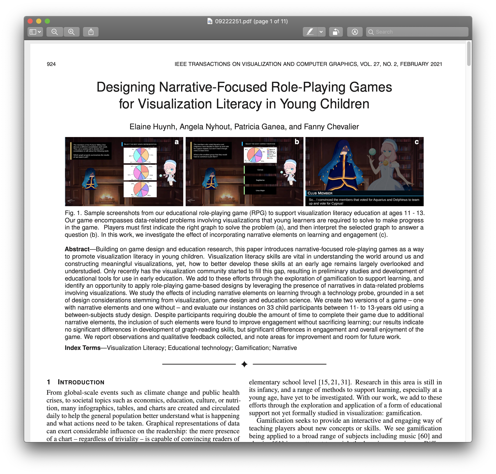
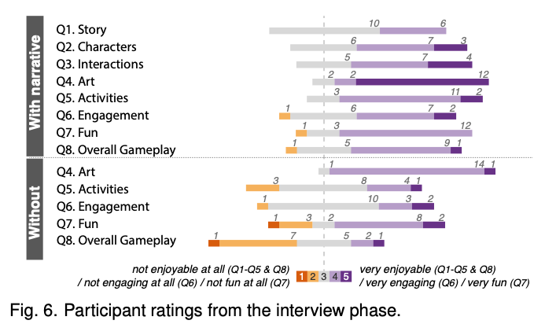

Week 10 Reflection
===

Author
---
Joseph Yuen

Paper
---
[Designing Narrative-Focused Role-Playing Games for Visualization Literacy in Young Children](https://ieeexplore-ieee-org.ezpxy-web-p-u01.wpi.edu/stamp/stamp.jsp?tp=&arnumber=9222251&tag=1)

Reflection
---

Although I found last week's paper on the use of video game engines for immersive data vis to be interesting, I wanted to look at a different aspect of gaming and data vis. This paper explores visualization literacy - the ability to understand and appropriately handle data vis - for children aged 11-13 through the use of narrative focused RPGs. Vis literacy is extremely important especially at an early age for understanding current events and preventing misinformation. And as a narrative game designer myself, I wanted to see the effect of narrative on learning outcomes in the data vis space.

Initially, I was surprised to read that games and vis literacy is a relatively new thing. Although educational games have existed for a long time, games specifically geared toward the growing of vis literacy are almost non-existent. I am skeptical that there are few games that teach vis literacy as most non-educational games have stats or metrics that must be understood to play the game, but regardless, this game was made specifically to measure and hopefully increase vis literacy in an academic context as there are mixed results on the effectiveness of narratives in learning.

To summarize the study, the authors created a narrative, fantasy game that had vis literacy questions and tested how the presence and absence of a narrative affected player learning outcomes and feedback. Unfortunately, the study found no significant differences in graph-reading skills leading. In some cases, narrative elements negatively affected some male participants and "exacerbate the degree to which people improve or do worse between the pre and post tests." This might have occurred due to the increased length of the narrative version of the game. The increased playing time could have led to player fatigue which could potentially negatively affect players' learning ability. However, the presence of a narrative increased player engagement and enjoyment which is important for keeping players interested and playing the game, as seen below. I am not completely surprised by these findings as other academic papers related to child learning through games found that factors that increase motivation and engagement don't necessarily translate to better learning outcomes. 

In addition, the study identified other factors that affect player experience and potentially learning outcomes. Aspects of game design and narrative design such as genre, combat, the presence of voices, character diversity, and multiplayer engagement are just some of the many factors that could be further isolated and explored. As such, I found this paper to be more of a jumping off point for the data vis world into education space. After reading the paper, I will admit that this paper seems more like about educational games more than a vis paper. The amount of vis specific items other than the problems used was in short supply. And since the research for games in education is already a widely researched topic, I was surprised that the authors didn't mention as many existing studies on narrative in games. But even so, I appreciate the effort to dive deeper and observe how a topic such as data vis may change the effectiveness of a narrative. For example, would math be learned better through a narrative focused RPG or perhaps reading?

I also found a smaller decision in the implementation of the game to be interesting. When deciding how to depict the data vis questions, the authors had to decide between using a "sketchy" style that matched the fantasy genre or using a "sharp" style that is prescribed by most data vis creators. The authors decided to opt for the "sketchy" style to maintain player immersion. This decision is an example of tailoring a vis to a specific audience even if it might go against the traditional rules for data vis.

Overall, the paper did not produce any major claims related to data vis and mainly supported existing educational game research. However, I found the paper to be interesting and will use the findings about narratives as a whole to increase engagement and enjoyment in my own games.