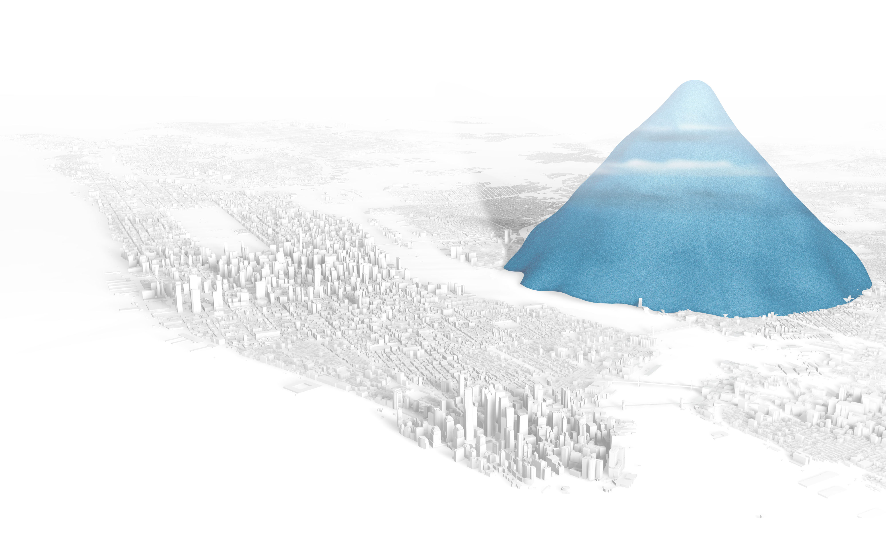

# Week 10 Reflection - [Drowning in Plastic](https://graphics.reuters.com/ENVIRONMENT-PLASTIC/0100B275155/index.html)

A visualization can show not only show graphed data but scaled data as well. *Drowning in Plastic* is one such visualization where it shows the world's addiction to plastic bottles. It gives little visualizations showing the size of the amount of bottles that are purchased every minute, hour, day, month, year, and the past decade. It then takes those numbers and compares them to well known structures like the Eiffel Tower or Burj Khalifa, the world's tallest building. As such, it then goes on to discuss the problems of pollution that these bottles are causing and the future endeavors of plastic output.