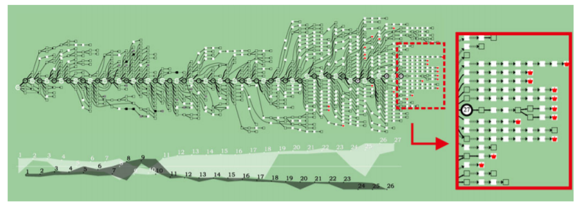

Week 10 - Chess Evolution Visualization
===
By Andrew Nolan

I like chess. For a while I was President of WPI's chess club. I was having trouble finding a data visualization paper that interested me this week, so I thought I would look at IEEE VIS and see if there were any papers on non-technical topics that I found fun. I searched for chess and this showed up! So here we are.

A standard chess position analysis/visualization tool will look something like the figure shown below. In this tool pieces you can capture appear highlighted in green, your pieces under attack are highlighted in red, and pieces partially under attack are highlighted in yellow. Arrows on the board show the recommended moves. In addition, most modern chess visualizations will also highlight the previous move. However, chess is not a one move game, the situation changes over time. Traditionally these columns on the left represent the recommended series of moves and expected opponent responses for a given position. This visualization below appears to show 5 sequences of moves and highlights two of them on the board. I've been using tools like these for over a decade now, so I am very comfortable and familiar with how to use them. However, these tools do not visualize the temporally evolving nature of a chess game. And the chess algebraic notation is hard to read for an untrained/novice user.

This paper proposes a new chess visualization to effectively convey the changes in a game over many moves. It is a multi-part visualization tool containing a score chart, evolution graph, and chess boards that can provide local move based and global overall game analysis of a chess match. An example of this tool can be seen in the following two figures. They use a modified version of a tree/directed graph to depict the game. The network is a tree of nodes and edges representing the moves and possible outcomes. It relies on the Stockfish engine with a search of depth 20 moves to calculate possible positions, this is typical of most chess visualizers.  (Stockfish the most powerful chess computer that is not driven solely by AI, it did lose to Alpha Zero). It stores all moves and shows what it considers key points. To represent the evolution of a chess game, the researchers want to show potential positions after multiple moves and depict key events "such as draws, effective checks, and checkmates". The visualization, like the traditional chess tools, only show moves that improve the position, it does not visualize potential outcomes that obviously detriment the player. 

The circles in the visualization represent actual moves, the squares represent moves calculated by Stockfish. To simplify the graph moves with only one or two direct responses were not shown, and instead the edge in the graph shows a "Several moves" arrows. Additionally, positions that repeat were merged into one node. The network is read from left to right starting at move 1 for white. The thickness of the arrows on the edges represents the relative gained advantage from each move. In the second image you can see the score chart at the bottom it represents the relative advantage of each player at a given move.

The researchers performed analysis using their tool on several famous games and reached similar conclusions to professional chess commentators and players. They claim their tool is effective for analyzing the evolution of a chess game over time. Especially since it makes it easier for users to jump between different possible branches to see the outcome. In the traditional chess visualizers/analyzers you cannot easily jump between branches as things play out sequentially and analysis is only shown for the current position. 

They also did a comparative user study between their system and a traditional chess system called Arena. The results shown in the figures below show that it took less time to answer questions about the chess games using their system and the users also had a higher correct answer rate. The user study had 21 participants, two-thirds identified as novice players. Participants not only were more effective using this system, but they also responded more positively to its design. 

In my personal opinion, as a chess player, I am not sure I would use this tool. Maybe as they show, it is effective for seeing overall patterns in a game. But from my experience I would argue the main use of these tools is to understand the specific positions were something goes wrong and could have been better The overall game is often decided by these few decisions. Looking at this large network could identify these mistakes, but it also would have lots of superfluous info. Additionally, and the researchers do mention this in their limitations and future work, this system does not actually show the chess positions. Users would need another tool or real life chess board to see were the pieces are. This tool just shows the relative advantage and key moments. With a board included this could become a more helpful tool. But a board takes up a lot of screen real estate and I believe the traditional design may be more effective. I think sequentially seeing the board and the evolution of the game is a more effective learning tool than seeing an overall evolution as this visualization shows. But, I'm not a published IEEE VIS author (yet) so these researchers may be on to something after all.

Sources
---
1. Chess Evolution Visualization - https://ieeexplore.ieee.org/abstract/document/6710145