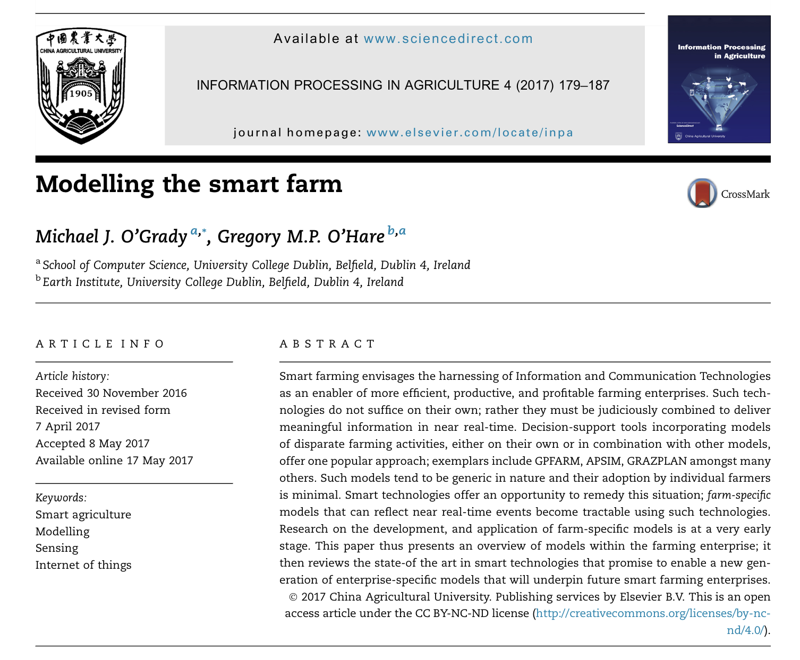

[Modelling the smart farm](https://www.sciencedirect.com/science/article/pii/S2214317316301287)

For today I read an article related not directly to visualization but related to the final project. This article is relevant because it has to do with farm-specific modeling which is what I had in mind for the project, data visualization that could be directly useful for farmers. I thought reading it could give me ideas for the project. 

The introduction mentions visualization of information as an important aspect of enabling decision making for farmers which was a driver of the project idea. The article mentions GPS enabled collars for livestock which is something I had not considered looking in to. Doing something with grazing plans is an interesting idea to me. 
