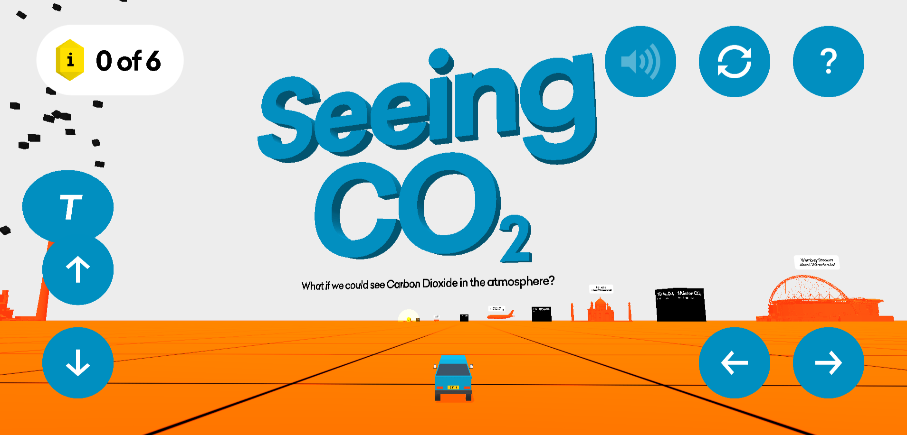

# Week 11 Reflection - [Seeing CO2](https://extraordinaryfacility.com/co2/)

Interactions for visualizations can also be in a game like format. *Seeing CO2* is one such game where your drive around in a car exploring landmarks and statistics and compare them to the height of certain carbon dioxide emissions. It also gives useful facts as collectibles including that the world produced 36 gigatons of CO2 in 2018 and that just one gigaton is the height of Mount Everest. Although the controls are a bit finicky, it does give a sense of urgency to solve the problem currently being presented.