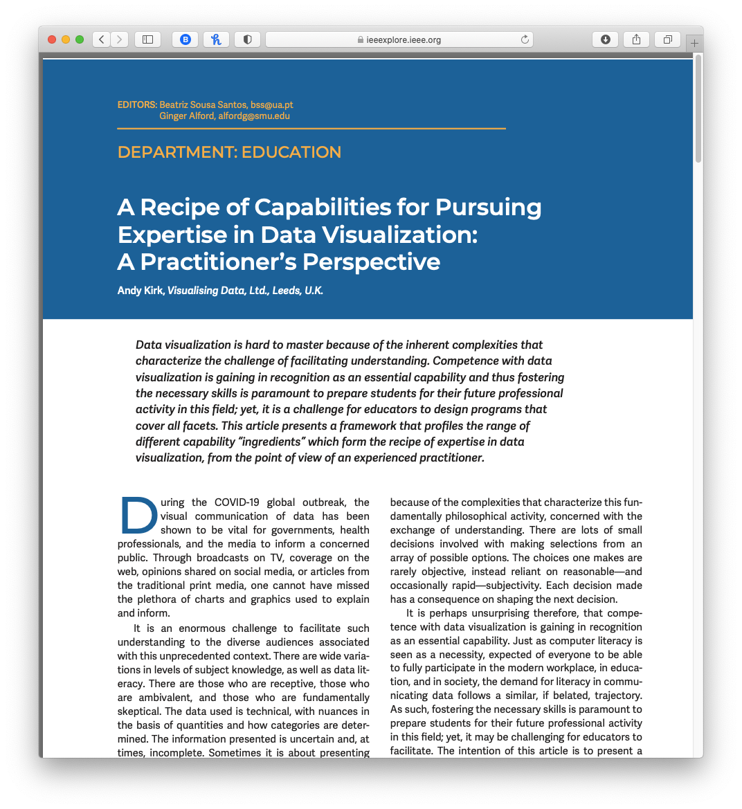

Week 11 Reflection
===

Author
---
Joseph Yuen

Paper
---
[A Recipe of Capabilities for Pursuing Expertise in Data Visualization: A Practitioner's Perspective](https://ieeexplore.ieee.org/stamp/stamp.jsp?tp=&arnumber=9325144)

Reflection
---

In my last entry, I reflected on the topic of visualization literacy. As I am still interested in data visualization education, I wanted to look at a more general article on how to tailor education for a data visualization context. 

The author breaks down data visualization into 7 "hats" or roles:

1. The Director - oversees the project
2. The Communicator - concerned about people
3. The Journalist - pursues the enquiry
4. The Analyst - handles data work
5. The Scientist - provides scientific rigor
6. The Designer - drives the creative direction
7. The Technologist- constructs the solution

Each hat represents a set of skills and responsibilities in a data visualization project. From a teacher perspective, each role can be taught as a topic of interest. From a manager perspective, each role can be filled with a person or be trained with an existing employee. From an individual perspective, each role can be seen as a "checklist of the capabilities required" and be used for self evaluation. I find that I tend to lean towards and may be more inclined to the director, the designer, and the technologist roles. Even so, I would not say that I am an expert in them. I think I would need to interact more with a client/expert and increase my data scientist skills to become a more well-rounded data visualization-ist.

In reflection of the hats themselves, I find the break down to be rather practical and thus effective. Not only is the framework relatively simple, but each hat represents actual job which allows learners to tailor their learning to a set of real world skills.

The author also discusses how to evaluate the success of a visualization. Although he doesn't go into as much depth as we did in class, he identifies the general concerns in the vis community related to evaluation. Rarely are there actions that can be quantified and analyzed. Many times designers will need to gather qualitative data through potentially expensive means. Some of these means are capturing anecdotal evidence, running an informal poll, or even running a formal case study/experiment. I also appreciate how the author acknowledges self-reflection of one's contribution in relation to the success of a visualization, as it can be overlooked and helpful for future growth.

Lastly, the author lists different learning strategies for educators:

- Self-directed learning - exposure to the data vis internet community, challenging one's design by reviewing others, passion projects 
- Collaborating with others - bring together a diverse group of talent, not just 1 hat
- Networking - social media data vis community is willing to help; go to conferences and meetups
- Looking beyond - exposure to outside fields may be enlightening and enhance data vis abilities

I think the professor has tried to implement all of these learning strategies through the use of these reflections. It allows us as students to network with the vis community, review good design, and look beyond data vis by exploring our passions in relation to data vis. Through a3, we were able to collaborate with others bringing together people who wear different hats. And the final project in particular gives us the opportunity to pursue our own interests and explore new technologies.

Even though this paper was less technical than others I have read in the past, it allows me to do a meta analysis of the class and perform self reflection of my own data vis skills. As such, I have found this class to be particularly exploratory and informative and learned of my data vis strengths and weaknesses giving me a direction on how to continue my learning in this field.