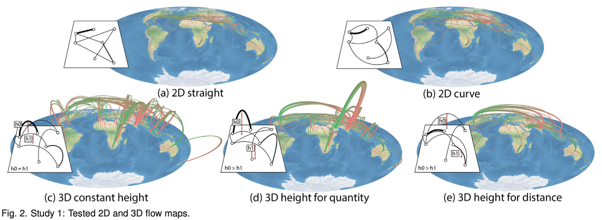
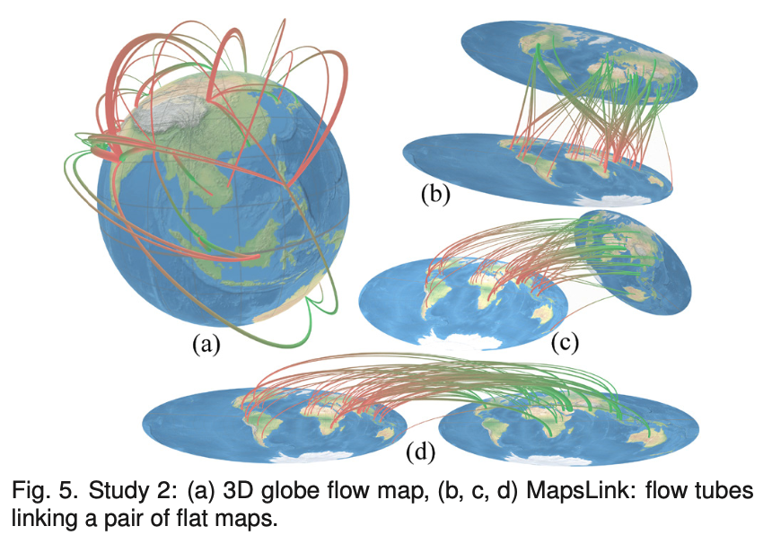

Week 12 Reflection
===

Author
---
Joseph Yuen

Paper
---
[Origin-Destination Flow Maps in Immersive Environments](https://ieeexplore.ieee.org/stamp/stamp.jsp?arnumber=8440844&casa_token=IG0vhb5-oRcAAAAA:DFk0n7rqwHakI0CWtbz12AA93KzNHgQgdNvUY-Em0TCIeYLhGvfiB0-Erwwq0mj_rb1HgSGY6Q&tag=1)

Reflection
---

As I am observing spatial geographical data for my final project, I thought that a paper on map encodings may reveal insights on how to best present map data. 

This paper explores the use of 2D and 3D map encodings with the use of head mounted displays (HMDs). The authors conducted 3 studies with the last two being very similar except with a difference in data set size. In all of the studies, the authors compare various encodings and how fast and accurate users can compare 2 flows on a map. The implementation is slightly similar to that of a3 in which we asked users to compare 2 data points in various encodings and find their relative difference.

In the first study, the authors looked at 5 different map encodings as shown below. I won't go into each of them for the sake of brevity, but I'll discuss the major findings. They found that the 2D straight map had the fastest response time, while 3D height for distance had the most accurate readings.

In the second study, the authors compared a 2D straight map, a 3D height for distance, a 3D globe, and a unique type of encoding called MapsLink (not in that uses a series of flat maps connected by tubes. MapsLink and the globe are shown below. The authors found that the globe was significantly more accurate than the 2D straight and MapsLink. And although there was some evidence that the globe was more accurate than the 3D height map, the data was not statistically significant. MapsLink also was slower than the other representations. When analyzing MapsLink, users spent most of their time just moving the map. 

In the third study, the authors just looked at a 2D straight map, a 3D height for distance map, and the globe with a larger dataset. A larger dataset is important to test since a larger dataset will have more lines which may be more difficult to read. The authors found that once again the globe beat out the 2D and 3D maps in accuracy but also speed. In addition, the globe was preferred by users even though the user can only see half of the map at a time. I think this preference exists mainly due to the incorporation of HMD technologies. If not, then the feature of geo-rotation would likely be inhibited. Even though a mouse and keyboard could replicate the movement, I wonder if it would decrease the globe's preference.

Even though I realize origin-destination flow maps may not be as applicable to my project as my data set does not contain linked data (ex: origin and destination), I find the discussion on 2D vs 3D visualizations with AR/VR technology to be insightful as 3D visualizations tend to get a bad rap for being cluttered or un-intuitive in most contexts.