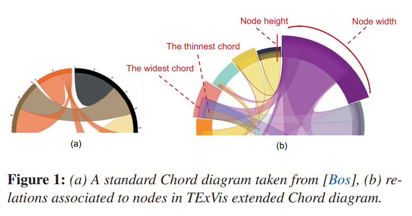
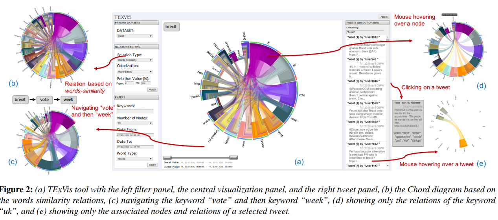

Reflection
====
Link:https://diglib.eg.org/bitstream/handle/10.2312/eurovisshort20171149/151-155.pdf    
    
As we known, social media is everywhere in our daily life. People can post there and the paper I found last week is about developing a tool to explore the relationship between the key words. This tool used chord diagram to visualize key words. However, the traditional chord sometimes will create overlapping chord at the associated side. So, author proposals an enhanced chord diagram. In order to avoid chord overlapping, the enhanced chard diagram order the chords based on their weights, such that the chord with highest weight value is placed at the outermost, while the second next one is placed above the previous one, and so on till the chord with the least weight value.    
    
    
The interface of this tool is displayed in figure 2. It consists of three parts: the filter panel at the left side, the visualization panel in the center containing the extended Chord diagram built using the d3.js library, and the tweet panel at the right side.   
      
    
I found that enhanced chord diagram has more advantage to display more chord because Users can easily distinguish overlapping chord than normal chord diagram. During A4, I found that the layout of interface is important in visualization. If layout of visualization is designed reasonable and clear to users, visualization will be more easily to understand by users. And the layout in this paper can be a good example for us.
