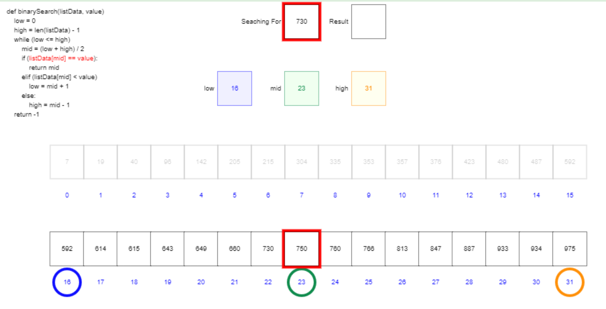

# Week 12 Reflection - [Binary/Linear Search Visualization](https://www.cs.usfca.edu/~galles/visualization/Search.html)

Visualizations are a subset of computer processes in a nutshell. So, for this week's visualization, we have one that visualizes a step by step process of how a binary and linear search is conducted on a sorted list. It plays a basic animation about how each search works including local variable parameters and the current box being looked at. The animation can be played fluidly, or stepped in either direction. Finally, you can choose the side of dataset to use and the width and height of the screen, though that tends to cut off data.