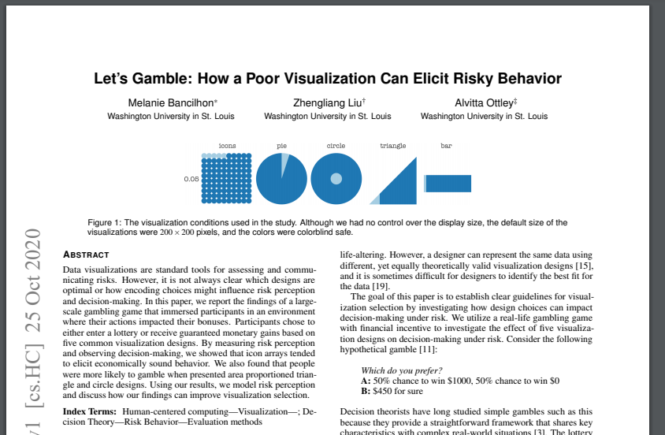
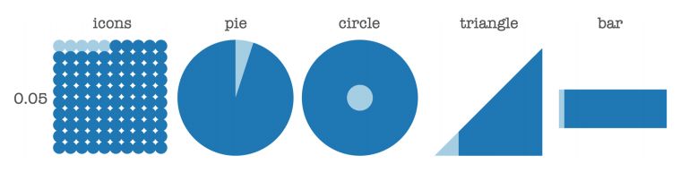
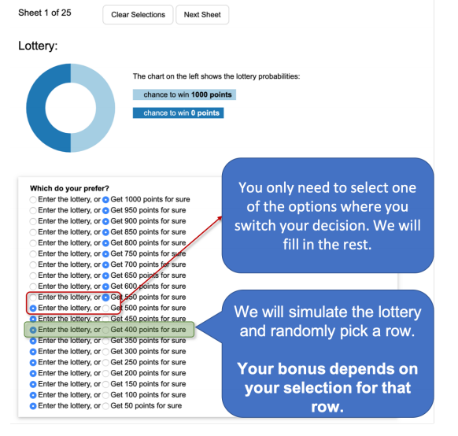
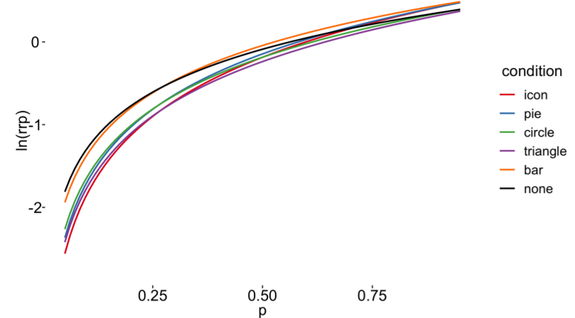

Week 12 - Let's Gamble: How a Poor Visualization Can Elicit Risky Behavior
===
By Andrew Nolan (4-26-21)

As this semester progresses, I am becoming increasingly aware that I have a strong interest in learning more about using computers to predict human decisions. Luckily, I am taking a Predicting Human Decision class. Last week, on Tuesday April 20th, our class had a guest speaker talk about using visualizations to affect human decisions. This speaker was Melanie Bancilhon of Washington University in St. Louis. She talked about several papers, but the one that interested me the most was "Let's Gamble: How a Poor visualization can Elicit Risky Behavior".

This paper, similar to what we did in A3, works to compare the effectiveness of different visualization idioms. In this experiment they are trying to determine if there is an optimal encoding for uncertainty data or if a poor encoding can cause risky decisions. They tested six methods, five encodings: icon arrays, pie charts, circle charts (a donut chart where the hole in the donut compared to the rest of the disk is the proportion compared), a triangular area chart, and a bar chart (specifically a single stacked bar), also no visualization (just text) was tested as a baseline. These visualizations can be seen in the figure below.

What it means for a human to make a decision is not agreed upon. The general process can be decomposed into: Input -> Process -> Output. But that really doesn't mean too much. Psychologists often say we make choices based on evidence/beliefs about specific events. Economists claim we make decisions based on a weighted sum of outcomes and their probabilities. Regardless, of which approach you follow, visualizations are becoming increasingly prevalent tools in decision making situations. 

Related work for this paper touches on a lot of similar papers to what my team read for our final project prospectus on Weather Uncertainty. For example, the paper *When(ish) is my Bus?*. The (possible) issue with all of these papers is that there are many different ways to visualize uncertainty/risk data and in situations in which the outcome can significantly affect the decider, visualizations can play a key role in high stakes choices. This paper tries to understand the impact visualizations can have on decision making.

The experiment conducted for this paper replicates a classic experiment from the domain of economic decision making. Study participants are presented a lottery with 20 choices each with two sets of options, a guaranteed prize or a gamble. The choices range in probability, the best being a gamble for a X point prize and a guaranteed X point prize. The riskiest outcome being a gamble for a X point prize or a guaranteed X/20 point. The lottery randomly picks one of the rows and then your choice within that row determines your prize. When making their choices, the participants could see the probability of winning the lottery choice via one of the five visualizations described above. An example of the test scenario can be seen in the figure below.

300 Amazon Mechanical Turkers participated in the study. The quality of the lottery decisions was measured using a metric called Relative Risk Premia (RRP). An RRP of 0 implies "risk neutrality", a high RRP implies risk aversion, and consequently a negative RRP implies risk seeking behavior. There were two hypotheses with this experiment:
1. Decisions would follow "Prospect Theory", i.e. participants would be risk seeking for small probabilities and risk averse for large probabilities. (Prospect Theory says humans overvalue relatively rare events and undervalue common ones).
2. Visualization design will affect the decisions made.

No matter the conditions, participants were found to be risk-seeking with low probabilities and risk averse with high probabilities, supporting hypothesis 1. The results of the experiment found icon to be have the least deviation from risk neutral, closely followed by bar and pie. Triangle was the least effective. Bar was shown to be closest to no visualization. Possibly implying the bar was as interpretable as text, supporting previous findings. The log RRP results vs probability of the gamble can be seen here.

Triangle and circle visualization groups varying far from the base line none groups implies that data presentation can influence risk behavior. These are the only two groups that differed significantly from the base line. The paper states that this should be taken into account for researchers presenting data.

The study mentions it's gambling game as a limitation and encourages future research using RRP to occur with other scenarios. I found this paper interesting. It seems to be consistent with famous Cleveland and McGill experiment (position being the most effective encoding channel). Although seeing it applied to uncertainty is cool. I think it's important to think about how the tools we are designing can be used in real life.

Sources
---
1. Let's Gamble: How a Poor Visualization Can Elicit Risky Behavior - https://arxiv.org/abs/2010.14069