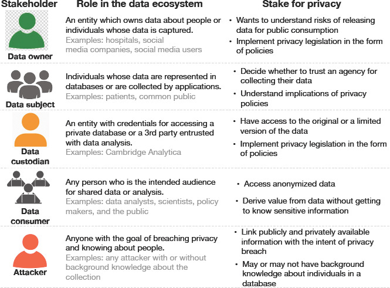
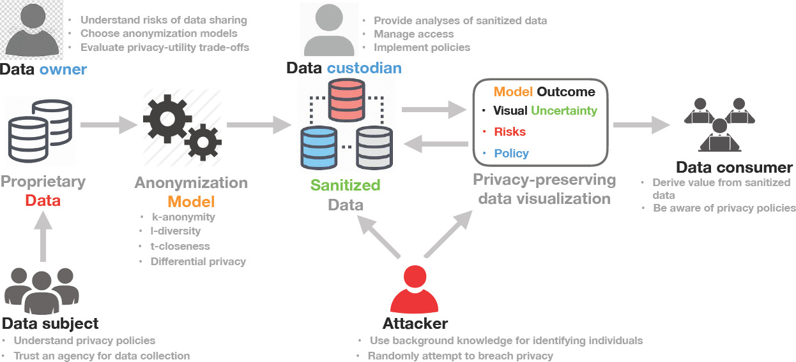
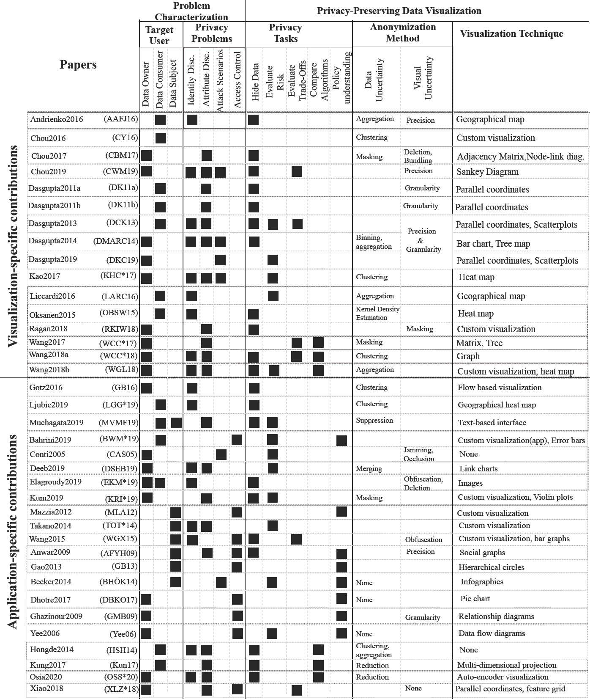

# Week 12 - Privacy-Preserving Data Visualization: Reflections on the State of the Art and Research Opportunities

[Paper Link](https://onlinelibrary.wiley.com/doi/10.1111/cgf.14032)

Authors:
Kaustav Bhattacharjee, Min Chen and Aritra Dasgupta

Abstract: 
Preservation of data privacy and protection of sensitive information from potential adversaries constitute a key socio-technical
challenge in the modern era of ubiquitous digital transformation. Addressing this challenge needs analysis of multiple factors:
algorithmic choices for balancing privacy and loss of utility, potential attack scenarios that can be undertaken by adversaries,
implications for data owners, data subjects, and data sharing policies, and access control mechanisms that need to be built into
interactive data interfaces. Visualization has a key role to play as part of the solution space, both as a medium of privacy-aware
information communication and also as a tool for understanding the link between privacy parameters and data sharing policies.
The field of privacy-preserving data visualization has witnessed progress along many of these dimensions. In this state-of-theart report, our goal is to provide a systematic analysis of the approaches, methods, and techniques used for handling data
privacy in visualization. We also reflect on the road-map ahead by analyzing the gaps and research opportunities for solving
some of the pressing socio-technical challenges involving data privacy with the help of visualization.

Privacy preservation has become an antithesis to the the idea of
a digital data-driven era. Be it the smart devices that we use, the
online services we access, or even the places we visit, data about
our activities, identity, habits and preferences, are being collected at
an unprecedented rate. Privacy, a fundamental human right, is often
considered a collateral damage in a bid to personalize and monetize
commercial services offered to people. In this paper, researchers are attemping
to: a) investigate if and how visualization can empower data owners, subjects, 
custodians, and consumers to have a transparent understanding of privacy 
implications and b) provide guidance on how visualization can play a
significant role towards addressing the socio-technical dimensions
of data privacy. They analyzed the privacy tasks of privacy-preserving data visualization
, and introduced anonymization methods as well as visualization techniques too. We
can take an over view of all these information in figure 3. The also provided several
instances of privacy-preserving data visualizations in this paper, which are very impressive.

*Figure 1: Different stakeholders in the data privacy ecosystem.*

*Figure 2: Data flow and roles of privacy stakeholders.*

*Figure 3: Classification Scheme for describing the literature on privacy-preserving data visualization based on target users, privacy
problems, visualization tasks intended to solve those problems, and the anonymization method used in conjunction with a visualization
technique.*