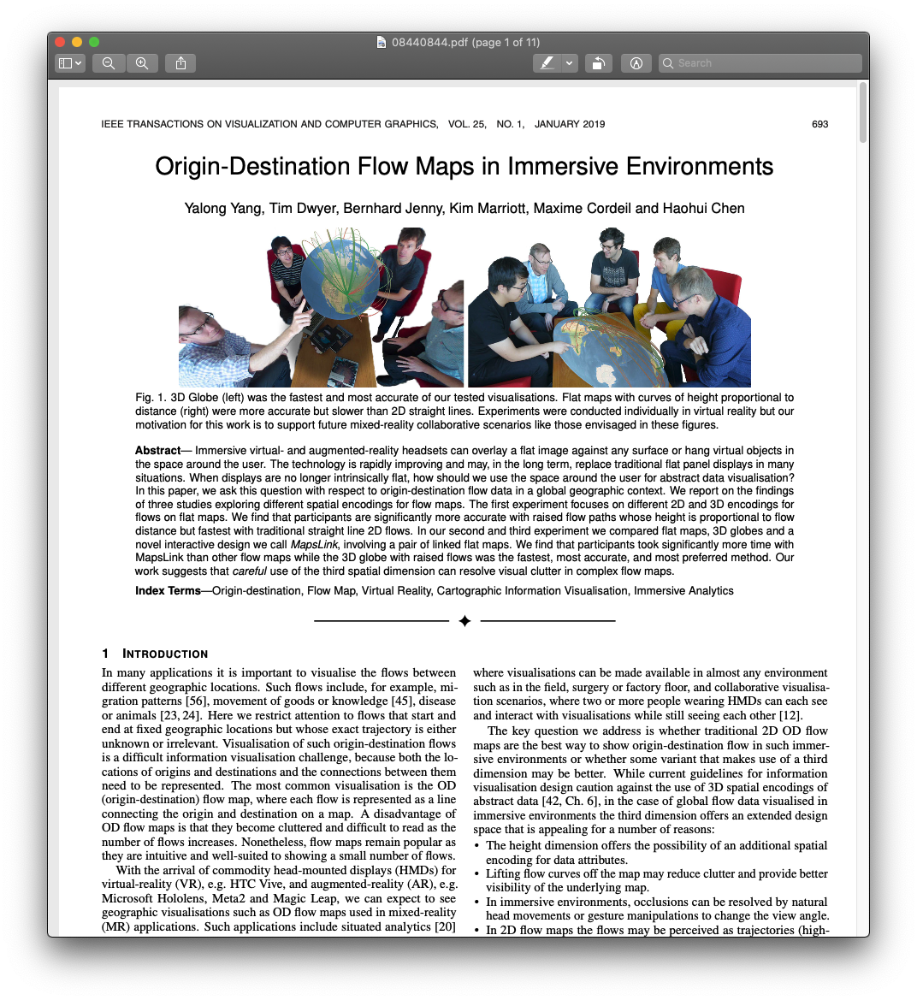

Week 12 Reflection
===

Author
---
Joseph Yuen

Paper
---
[Origin-Destination Flow Maps in Immersive Environments](https://ieeexplore.ieee.org/stamp/stamp.jsp?arnumber=8440844&casa_token=IG0vhb5-oRcAAAAA:DFk0n7rqwHakI0CWtbz12AA93KzNHgQgdNvUY-Em0TCIeYLhGvfiB0-Erwwq0mj_rb1HgSGY6Q&tag=1)

Reflection
---

As I am specifically observing spatial geographical data for my final project, I thought that a paper on map encodings may reveal insights on how to best present map data. 

Even though I realize origin-destination flow maps may not be as applicable to my project as my data set does not contain linked data (ex: origin and destination), I find the discussion on 2D vs 3D visualizations with AR/VR technology to be insightful as 3D visualizations tend to get a bad rap for being cluttered or un-intuitive in most contexts.

3 experiments
1. different 2D and 3D encodings for flows on flat maps
    participants are significantly more accurate with raised flow paths whose height is proportional to flow distance but fastest with traditional straight line 2D flows
2-3. compared flat maps, 3D globes and a novel interactive design we call MapsLink, involving a pair of linked flat maps
    participants took significantly more time with MapsLink than other flow maps while the 3D globe with raised flows was the fastest, most accurate, and most preferred method

work suggests that careful use of the third spatial dimension can resolve visual clutter in complex flow maps

Introduction
Origin Destination (OD) flow map - common but cluttered if too many flows
Head mounted displays with AR capabilities may be useful

Question: whether traditional 2D OD flow maps are the best way to show origin-destination flow in such immersive environments or whether some variant that makes use of a third dimension may be better

Even though 3d spatial encodings for abstract data are presented with caution, 3d encodings may be helpful for OD applications 
- The height dimensionoffersthepossibilityofanadditionalspatial encoding for data attribute
- Liftingflowcurvesoffthemapmayreduceclutterandprovidebetter visibility of the underlying map.
- In immersive environments, occlusions can be resolved by natural head movements or gesture manipulations to change the view angle.
- In 2D flow maps the flows may be perceived as trajectories (high- ways, shipping routes, etc.), lifting them into the third dimension
may resolve this ambiguity.

3 main contributions
1. chart the design space for 3d flow maps - separate the design space into two orthogonal components: the representation of flow, e.g. straight or curved lines in 2 or 3D, and the representation of the geographic reference space, e.g. 3D globe or flat map
2. evaluation of different flow maps in VR differing in the representation of flow - compared 2D flow representations with (a) straight and (b) curved flow lines, and 3D flow tubes with (c) constant height, height varying with (d) quantity and (e) distance between start and end points
3. evaluation of different flow map visualisations primarily varying in the representation of the reference space

Height of a 3d flow may be used to show a new sort of encoding or data

searching for the flow line between two given locations and comparison of magnitude of two flows

