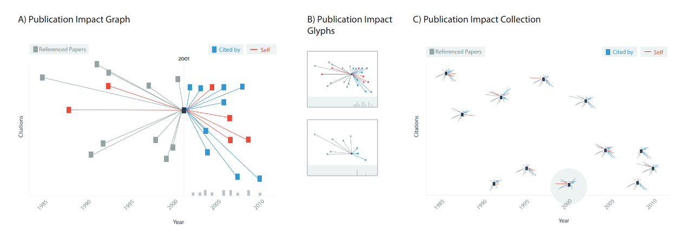
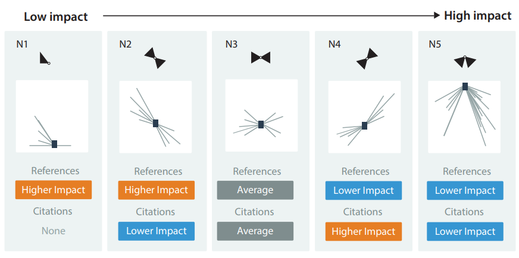

Reflection
====
link:http://diglib.eg.org/bitstream/handle/10.2312/eurovisshort20161169/103-107.pdf

The paper I found last week is about to create a visualization to represent the impact of a publication. In traditional way, people are used to assess a publication by how many citations it has. However, this way may cause misleading, because the weight of citation vary and author can cite their own publications. To address these challenge problems, this paper proposals a visualization to assess impact of publication.   
   
In section A of figure 1, publications are generally represented as nodes; red nodes represent author’s own publication. Blue nodes represent publication that cited this publication. Gray nodes represent reference publications. X axis represents date of publication, Y axis represents number of citations. Glyphs in B is a more compacted version of Glyphs in B. In figure C, it is impact overviews which provide a way of viewing many papers.   
   
   
There are five topological structures that author believes adequately represent the common citation patterns for publications. They are:   
   
With the help of these motifs, users can intuitively know what level of impact the publication belongs to in the impact overview.    
   
Compared with traditional way to assess impact of publication, I think the way in this paper is more convinced. It not only considers the number of citations the publication has but also takes weight of citation into consideration. I think this method can be applied to other scenarios，such as presenting social network of people. 
