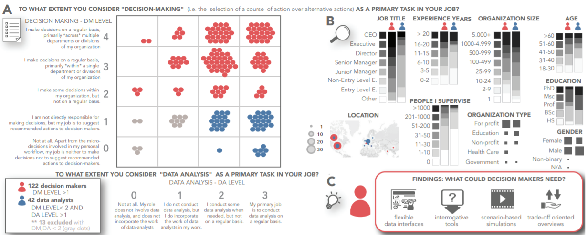
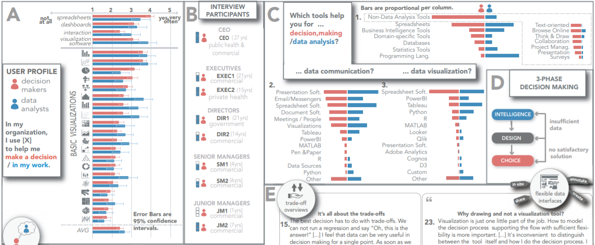

# Week 13 - The Unmet Data Visualization Needs of Decision Makers within Organizations

[Paper Link](https://ieeexplore.ieee.org/abstract/document/9408391)

Authors: 
Evanthia Dimara; Harry Zhang; Melanie Tory; Steven Franconeri

Abstract:
When an organization chooses one course of action over alternatives, this task typically falls on a decision maker with relevant knowledge, experience, and understanding of context. Decision makers rely on data analysis, which is either delegated to analysts, or done on their own. Often the decision maker combines data, likely uncertain or incomplete, with non-formalized knowledge within a multi-objective problem space, weighing the recommendations of analysts within broader contexts and goals. As most past research in visual analytics has focused on understanding the needs and challenges of data analysts, less is known about the tasks and challenges of organizational decision makers, and how visualization support tools might help. Here we characterize the decision maker as a domain expert, review relevant literature in management theories, and report the results of an empirical survey and interviews with people who make organizational decisions. We identify challenges and opportunities for novel visualization tools, including trade-off overviews, scenario-based analysis, interrogation tools, flexible data input and collaboration support. Our findings stress the need to expand visualization design beyond data analysis into tools for information management.

The researchers of this project found there are some unmet data visualization needs of decision makes
within organizations. Firstly, they grouped participants as “decision makers” or “data analysts” based on their answers to the Decision Making
(DM) and Data Analysis (DA) questions. We can see the group result, survey demographics, and emerging themes 
from their interview analysis in figure 1. Then, the researchers surveyed real world decision makers to understand
their work practices. The survey result is shown in figure 2. After that, they conduct two interviews.
The first one is an interview with some of their survey participants to understand decision maker profiles in more depth, as well 
as to identify challenges and opportunities for novel visualization tools. The second one is ask expert
 decision makers about their data visualization needs. Both survey and interviews suggested that 
 decision makers lack “decision making” tools designed to support the flow along all decision 
 phases: INTELLIGENCE, DESIGN and CHOICE. In conclusion, design visualizations to better support decision 
 makers might be a new research field.

*figure-1*

*figure-2*

