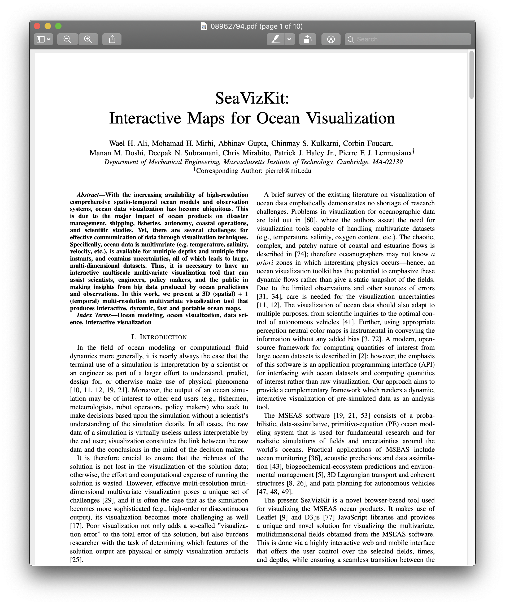
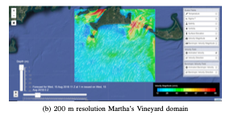
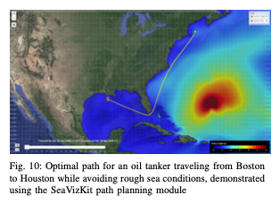
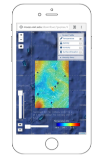

Week 13 Reflection
===

Author
---
Joseph Yuen

Paper
---
[SeaVizKit: Interactive Maps for Ocean Visualization](https://ieeexplore.ieee.org/stamp/stamp.jsp?tp=&arnumber=8962794)

Reflection
---

While previously reviewed papers mainly discussed scientific experiments, this paper describes a data visualization API called SeaVizKit and its practical applications.

Before reading this paper, I never cared nor thought about ocean visualization, but I knew it was probably difficult considering the dynamic nature of water. Although algorithms such as MSEAS and programs like D3 were used to create such a library and are relatively interesting to talk about, I want to be a bit more meta today and reflect on the considerations when making a data vis API such as SeaVizKit versus a stand-alone data visualization.

To start, SeaVizKit is a "novel browser-based tool used for visualizing MSEAS ocean products." In the paper, the authors discussed 3 different use cases of the product. Although each experiment simulated water, they each focused on a different aspect of the ocean which may be used by a variety of users such as fishermen or ship navigators. Below are the 3 different use cases and their main takeaways:

1. POSYDON Sea Experiment 2018 - displayed surface velocity
2. NSF-ALPHA Sea Experiment 2018 - demonstrated material flow
3. DRI CALYPSO Sea Experiment 2019 - showed surface salinity

Example of Interface

These takeaways are important as they demonstrate the modular design of the SeaVizKit allowing for a broad audience. Even though it is obvious that a visualization be suited for its intended audience, APIs typically offer broader tools which maybe implemented for specific use cases. Thus, I think effective APIs are inherently more difficult to scope than stand-alone data visualizations. What is needed is an extensible modular design that still takes into account the needs of the general audience. SeaVizKit does this by having selectable filters that customize the map's output. In the example below, we can see the path planning module for captains to optimize their shipping routes based on ocean data. 

Speaking of general audience needs, I realize my needs as a typical data visualization consumer are very different to that of SeaVizKit's audience. Before I read this paper, most of my experience with visualization was in front of a computer screen sitting down. But for ship captains and fisherman, my data visualization experience is very sedentary and relies upon a strong internet connection. For those out at sea, however, the reality is far more dynamic and costly. Thus, SeaVizKit needed to not only be accessible on a web browser with portable hardware like a smart phone (as seen in figure below) but also be able to output relevant data with a potentially weak connection to the internet. These small considerations mentioned in the paper reminded me that APIs need to be modular and take into account the dynamic nature of the real world and its effect on its users.

Although this paper may not be as novel as others, it reveals the practical considerations one must take into account when making a vis or an API for vis. I also hope to use aspects of the modular filters implementation in my final project to encourage user exploration.