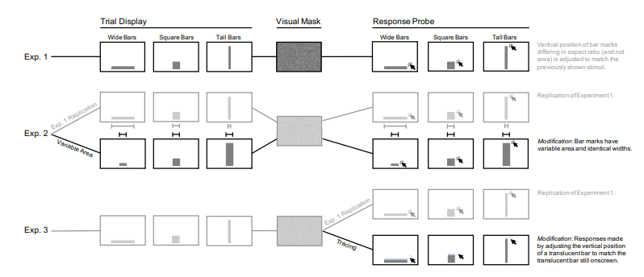

Week 13 - Truth or Square: Aspect Ratio Biases Recall of Position Encodings
===
By Andrew Nolan (5-3-21)

Another experimental paper! We know that bar charts, using the position encoding, are very accurate visualizations. Previous work has, paradoxically, found that bar charts can be biased with both under and over estimations. This paper did three experiments to test how aspect ratios and the limits of human memory can affect these biases.

The first experiment tested if ***aspect ratio*** affects perception of position. Participants each performed 216 trials (72 of each type: wide, square, and tall). In each trial they were presented with a single bar, and then shown a blank screen, and then asked to redraw the bar. The results showed overestimation came from bars with wide ratios, and underestimation error came from tall aspect ratios. These results are consistent with previous work on Biases in bar chart aspect ratio from Xiong et Al. and McColeman et Al. An interesting pattern to the bias showed that users tended to misrepresent objects treating them as if they are closer to a square shape.

Experiment one varied aspect ratios but maintained the area of the rectangle. However, in the real world, typically a change in aspect ratios will also indirectly affect the ***area*** encoding of the graph. The second experiment repeated the procedure of the first test, but this time also varied the area of the bars. As with experiment one, this test showed underestimation and overestimation. Unfortunately, it was not possible to change the area of the bar without also changing the aspect ratio. The variance in these results aligned very closely with the first experiment. These results lead the researchers to the conclusion that area does not significantly affect the biases in bar charts, the aspect ratio appears to be the primary source of bias.

The third and final experiment tested ***the role of memory in position estimates***. This experiment slightly modified experiment one to include trials in which the initial bar is still present when the user is asked to redraw the bar. The results showed that most of the error was reduced by removing the memory component of the task. Possibly implying recall is the limiting factor for graphical perception. 

Below is a figure showing the procedure for the three experiments:

The three experiments show that position encodings can be biased based on aspect ratio, specifically underestimation when the aspect ratio is tall, and overestimation when the ratio is wide. Square ratios tend to be the most accurate. Additionally, human memory affects these perception biases, specifically through recall. This work supports previous findings and emphasizes that incidental visual properties can affect the original encoding channel, such as aspect ratio skewing position measures.

Sources
---
1. Truth or Square: Aspect Ratio Biases Recall of Position Encodings - https://ieeexplore.ieee.org/abstract/document/9222047