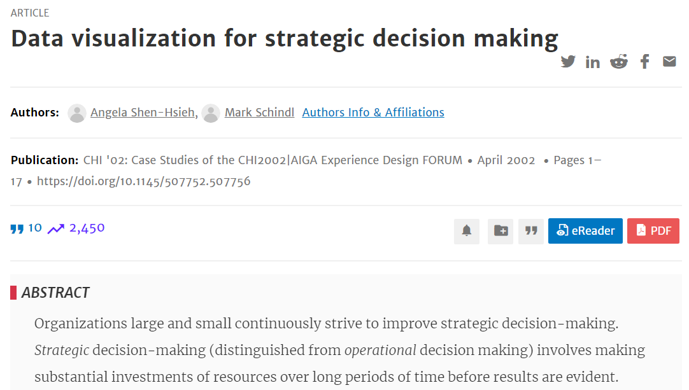
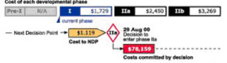
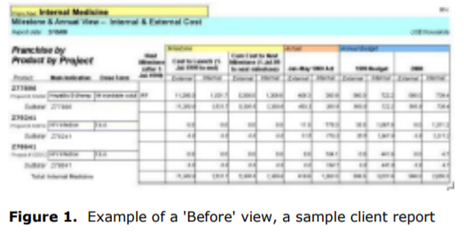
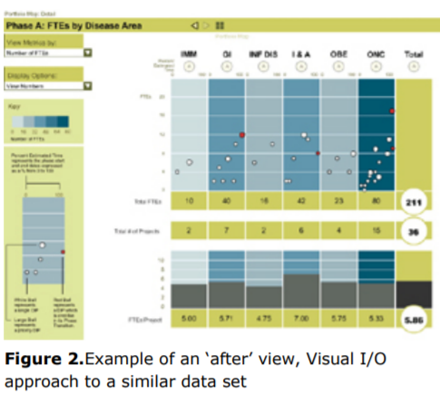
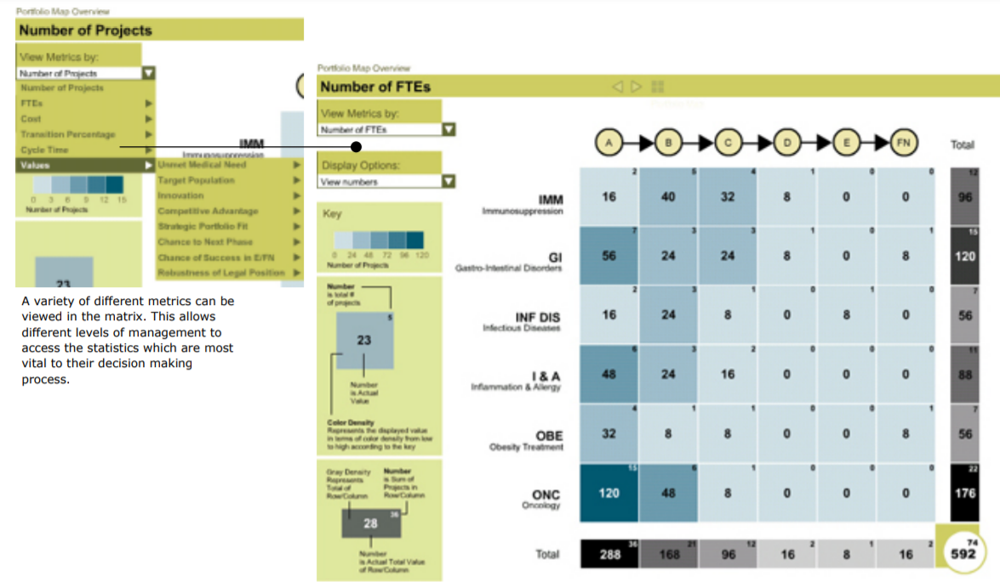
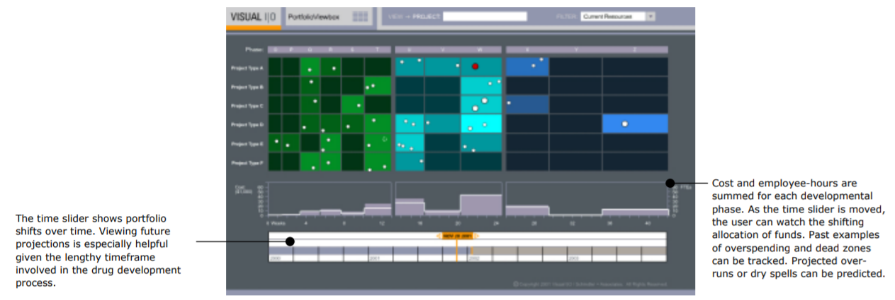
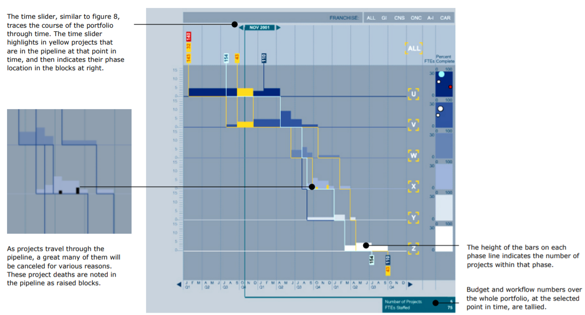

Week 14 - Data Visualization for Strategic Decision Making
===
By Andrew Nolan (5-10-21)

This week I found a case study published by CHI back in 2002. I have realized I am very interested in the intersection of decision making and data visualization. However, there do not seem to be too many papers about the topic, at least not too many recent results when doing a Google Scholar search of "data visualization decision making". I have discussed some of the recent papers I've found in previous reflections. But the apparent lack of papers makes me think maybe if I go back to school for a PhD this might be an area I would want to focus my research efforts in. I guess we shall see...

Anyway, this paper is a case study in designing a web-based data visualization tool to help a pharmaceutical R&D team plan long term strategic decisions. The paper defines strategic decisions as long term investments of resources (dollars, people, and time) affecting a business. Specifically, this tool is designed to help the R&D team decide if they should continue or abandon projects, the so called "Stop or go" problem. Ironically, this application was never fully used by the company, because while reevaluating their budget and IT spending this project was cut.

The paper examines two proposed systems designed to address the decision issue. The President of the company stated that he felt there was no comprehensive ***picture*** of the company, and that he had no way to ***see*** the full operation. The paper highlights the words picture and see. They made a proof of concept vis for the finance department, pictured below. After it was successful they planned to design a larger tool that could 'roll up'/aggregate data for high level managers and 'roll down'/provide detail view for lower managers of specific projects.

Sorry these are low resolution screenshots, it's how they look in the paper. 2002 was a different time...

The project spent a lot of time in user task analysis/preliminary design. An interesting observation. with this paper being a case study, is it shows how much effort needs to go into initial design when working with an actual client. When publishing your own academic paper, design is important, but you have final say and don't need to be held back from your ideas by someone else's whims. In the following images you can try to see what the initial data looked like, a tabular representation. The data primarily consisted of info about dollars, people, and time. Then in the next image you can see how the team restructured it into a visualization that would be more helpful for strategic decision making.

Again sorry for the low res pictures, its the best I could get from this paper.

In the after figure above, they call the visualization a "Drill Down" view. This vis shows a high level overview, but clicking on certain parts gives you more detailed data. The dots, specifically the red dots, indicate warnings, such as being over budget or understaffed.

The appendix of the paper has much larger easier to read figures of the tool. I'm going to share some of their other visualizations here. The first one is the Matrix Map. It shows a matrix of product lines vs project phases. It is intended to provide an overview of an entire company's portfolio to help understand where resources (such as people and money) are allocated.

The next two figures were only designs, they did not make it into the original product. The first figure is an advanced version of the previous "matrix map". This time with an emphasis on changes over time. The second view is a "pipeline flow". It shows the change in project phases over time.

The paper concludes by explaining that supporting decision making is a process, not necessarily  just an application. Companies have to make decisions about things to cut, and that's just business. They do believe that although the project ended abruptly, the initial success of the proof of concept tool in the finance department of this pharmaceutical company, and the enthusiasm of some executives implies that visualizations could be an important tool for business decisions. 20 years later, I'd say that's probably true. I think this paper was an interesting diversion from a lot of the more academic papers I have been reflecting on in recent weeks. It shows more of the industry angle and how visualizations can evolve to fit a customer's needs.

I think another super interesting aspect of this report is seeing how papers have evolved over time. Maybe since this is a case study its not the perfect representation. But it was published in CHI in 2002. Now, if you look at a CHI paper from 2020, it looks a lot cleaner and has many more references. I pulled up two random papers from the CHI 2020 free proceedings and they had 64 and 86 works cited in them. This paper has 10. I'm not sure if that's to say academia or CHI has gotten more competitive or more rigorous, but it was an interesting observation.

Anyway, I suppose that this is my final *formal* data vis reflection. I'm sure I will continue to read and reflect on papers on my own, but I'm not sure I'll be doing a weekly write up now that class is done. It's been fun though and I think I got to learn a lot through these reflections.

Have a nice summer!

Sources
---
1. Data Visualization for Strategic Decision Making - https://dl.acm.org/doi/abs/10.1145/507752.507756