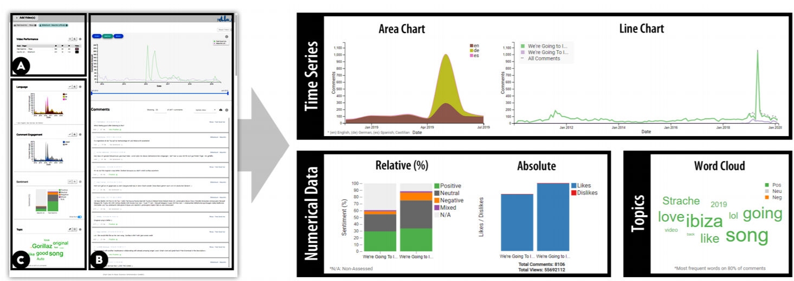
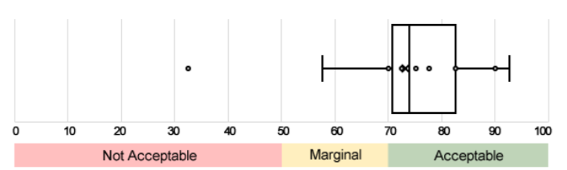

Refection 14
===
link:https://diglib.eg.org/bitstream/handle/10.2312/evs20201041/013-017.pdf   
   
The paper I found is about Design Study of a Visual Analytic Tool for the Music Industry Powered by YouTube Comments. Data on the social media are pretty precious as they can be used to improve the software to make users have a better experience. There are many tools to monitor social media, but none of them is based on music.    
   
In the first phase, they first semi-structured interview with music experts to find out problems which people concerns. They concluded that both the input from the public as well as long-term trust in the data used by the SMM tools are crucial. In the second phase, based on the previous problems, they identified three key functional and non-functional requirements:   
   
R1:To manage time-oriented and unstructured social media data;   
R2:Search for artists and songs;   
R3:Ease of use;   
R4:Data transparency;   
   
In the third phase, this tool is designed into three block areas, which is shown in figure 1. Users can search by song or artist and can be redirected to the original video on YouTube from this card in the block A. temporal development of the comments for each selected video is shown in the block B. Different visualizations are shown in the block C.   
   
   
Author tested this tool in the real world after they finished tool design. The result is shown as in the figure 2. User complained about about the line charts which is too small. However, the overall of the result is optimized.    
   
   
This paper provides us a successful example to design a visualization tool. Designing steps are similar with we learned on the textbook. First, we need to find out the problems by the most possible users or experts. Then identity the function the tool will have. When we finish visualizations, we need to evaluate it to check whether it is works good. The tool in this paper also used technology of linking visualizations which we used in A4. It makes me feel that what we learned in this class is powerful in realistic world.
