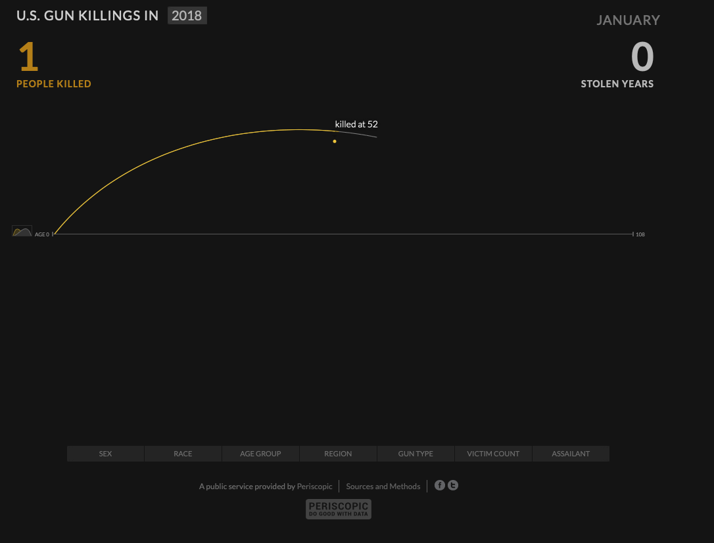
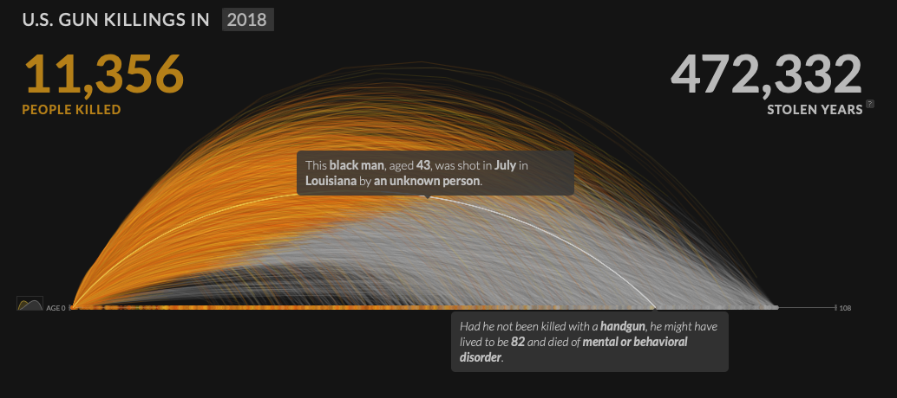
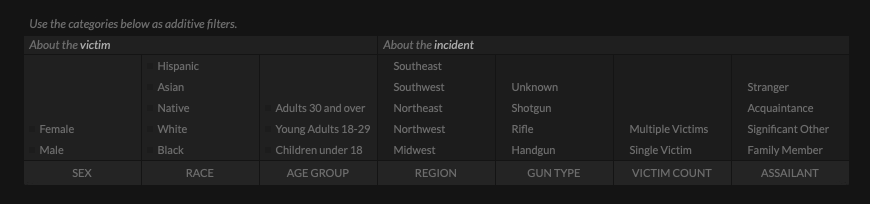
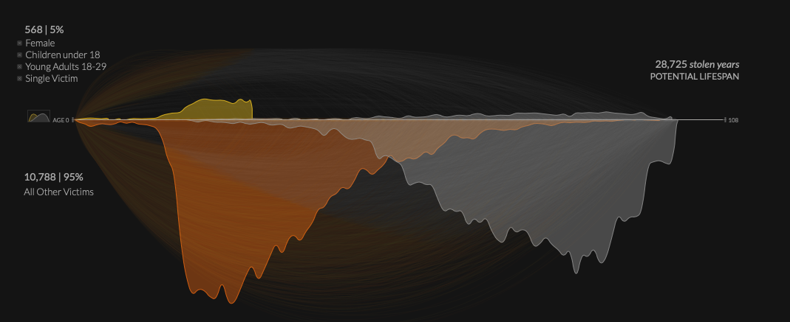

Week 2 Reflection
===

Author
---
Joseph Yuen

References
---
- [U.S. Gun Killings in 2018](https://guns.periscopic.com)

Reflection
---
I found this visualization from while exploring winners of the Kantar Information is Beautiful Awards. I thought that the vis was relevant to today's political climate as it displays information on shootings in the U.S. 

Upon entering the site, there is a dramatic animation that encapsulates the seriousness of the shooting problem in our country but also shows how the visualization works. The viz starts off with a single line, as seen in the figure below, which represents a single life. Additional lines are added with tool tips to show what information is revealed upon hovering over a line.

As I dabble in the realm of user experience design, I find that tutorials are difficult to develop effectively and tastefully. I am impressed that this vis uses its tutorial to set the tone of the work.

I want to also note the use of color that corresponds to the text at the top of the page. The orange symbolizes the life of a person, while the gray represents how much longer a person would have lived if not for guns. This coloring choice forces the user to see the orange and the connection to the text makes the vis relatively easy to understand at first glance.

The work doesn't stop there. After the initial animation is complete,  there is a checkbox filter system that allows the user to mix and match certain statistics. Interacting with the filters was simple and relatively easy to figure out without any guidance, and it got me thinking about balance between classic and complex idioms. By having too many complex idioms, the message of the vis may be lost as the user is more focused on the tool than the information. In this case, having a classic well known idiom such as a filter table brings more emphasis to the complex idiom that makes its information all the more important.

I was also impressed by the use of opacity to show the user their filter selection in comparison to other victims. I found this to be a bit complicated at first, but the text on the left cleared up the majority of my confusion. 

This vis is an excellent demonstration of an intuitive tool that evokes an emotional response for a serious topic.
