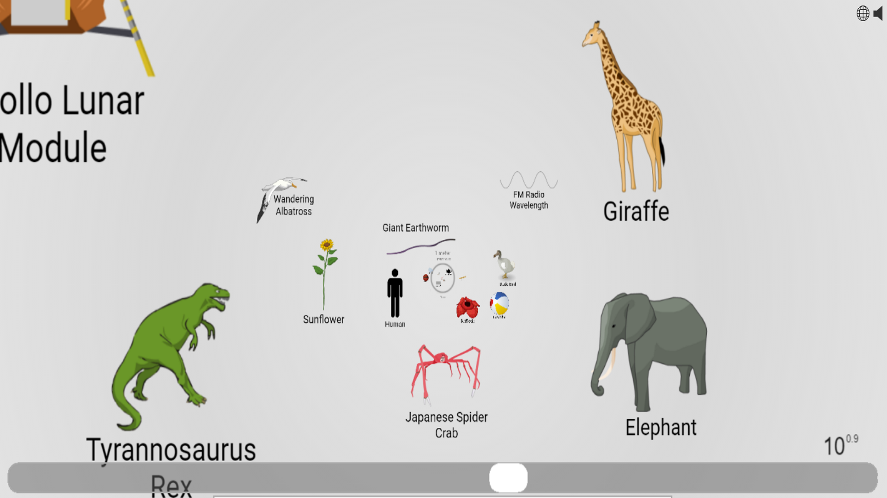
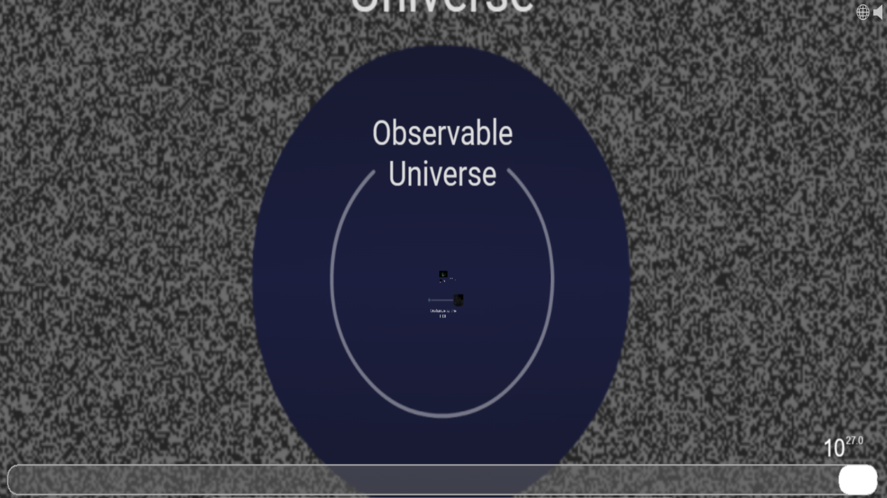
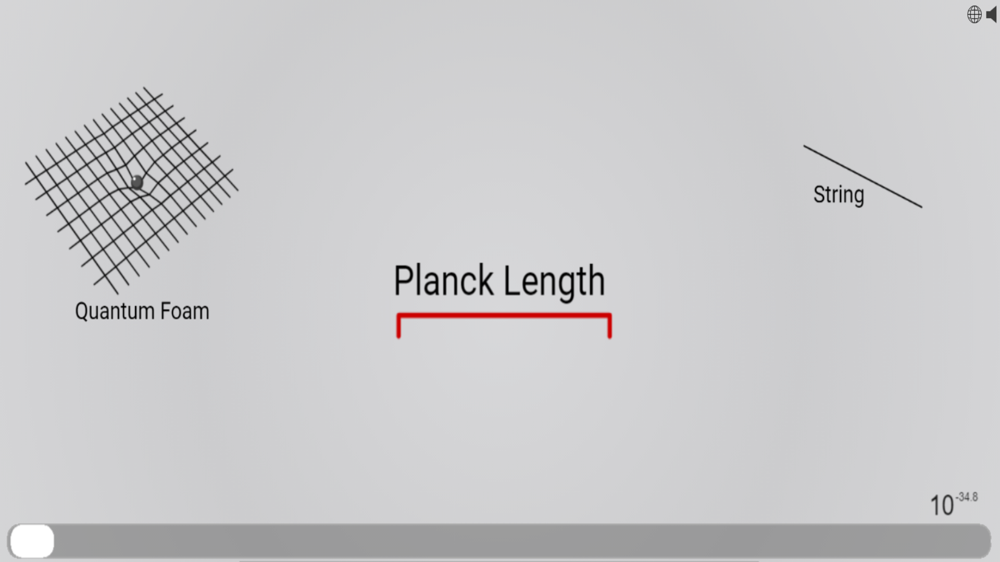

# Week 2 Reflection - [Scale of the Universe](https://htwins.net/scale2/)

One of the first visualization I've ever seen was the Scale of the Universe created a few days before the beginning of 2010. The original website that hosted the visualization no longer works since Adobe Flash Player is not supported. The link provided above is the second iteration of the project.

The size of the universe is a visualization which uses a mix of dynamic scrolling and embedded information to show the scale of some objects in the SI unit of length meters while providing a basic explanation of what each object is. It's used to give references of size via commonly known objects. The slider on the bottom of the screen is used to scale the objects and is shown the meter unit via the scientific notation on the above the right side.

The visualization does a very clever job by bounding the unknown edges of size.

The upper bound is stopped by the universe which represents everything we may not be able to obverse. This leaves room for greater and larger observations as we can only know what we can accurately observe.

The lower bound does the same except with quantum physics particles for theoretical minimums to denote the smallest unit we can observe. This allows the same level of detail to continue.

Although this visualization has been around for a little more than a decade, it is updated as needed to provide the most accurate information on what the size of the universe actually is. In my opinion, it is a great example of what a visualization should be.

## References
* [Original Website](https://scaleofuniverse.com/)
* [Current Website](http://sciencenetlinks.com/tools/scale-universe-2/)