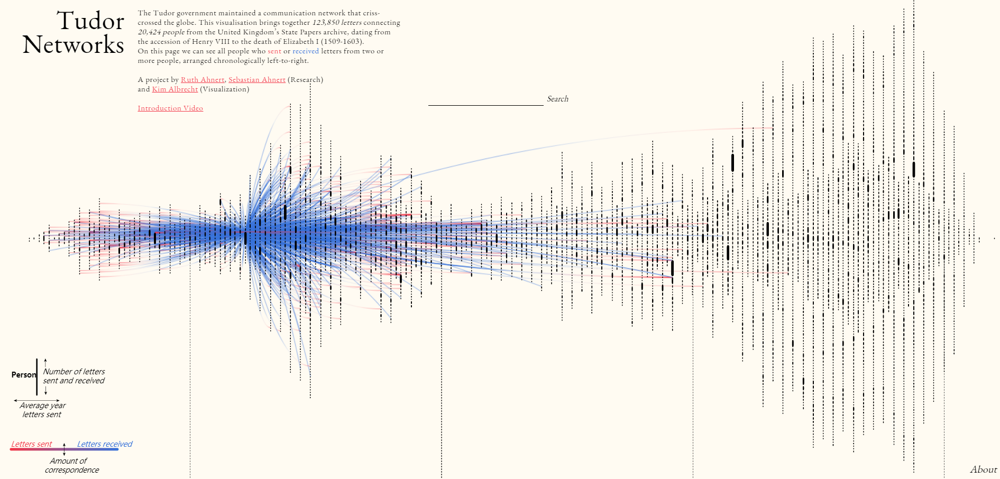
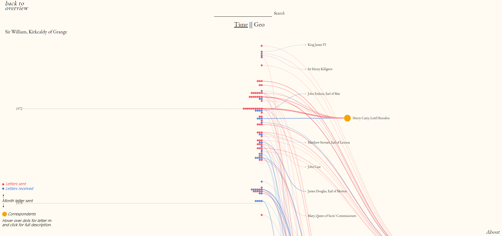
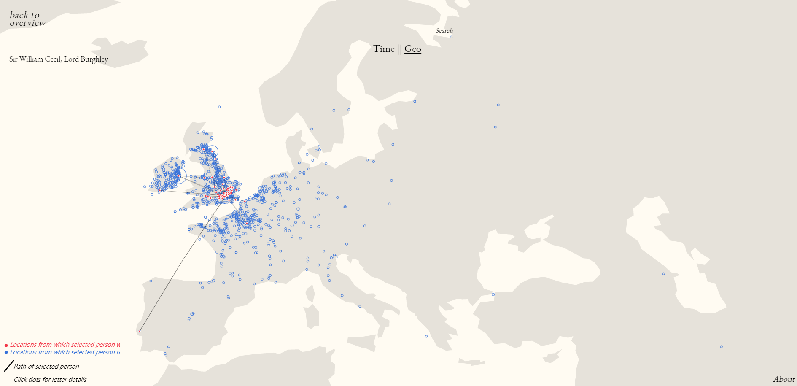

# Week 2 Reflection - Tudor Networks

## Resource 
[Resource link](http://tudornetworks.net/).

## Introduction
The Tudor government maintained a communication network that criss-crossed the globe. This visualization brings together 123,850 letters connecting 20,424 people from the United Kingdom’s State Papers archive, dating from the accession of Henry VIII to the death of Elizabeth I (1509-1603). 

On this page we can see all people who sent or received letters from two or more people, arranged chronologically left-to-right.

*Figure 1*

*Figure 2*

*Figure 3*

## Reflection
In Overview page, we can not only compare the number of letters sent and received by each person, but also know the trend of average year letters sent. In addition, we can see the cimmunication network of one person by clicking the dot which represents this person (Figure 1). Whatsmore, we can explore it by time (Figure 2) or by place (Figure 3).

What this visualization impressed me most is it visualized high-dementional datasets in a simple way. In other words, We can know a lot of information (the time and number of letters sent and received, the communication network, the location of each person, etc) from it but meanwhile we are totally not overwhelmed. I think we can get inspired by how this visualization arranged datasets.
