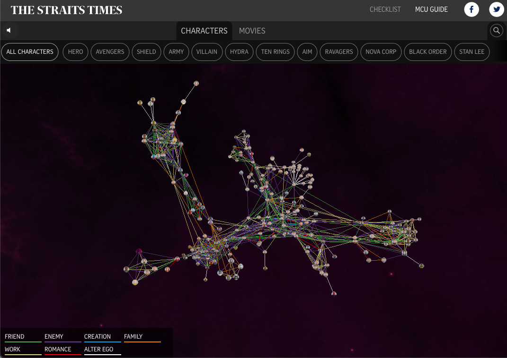
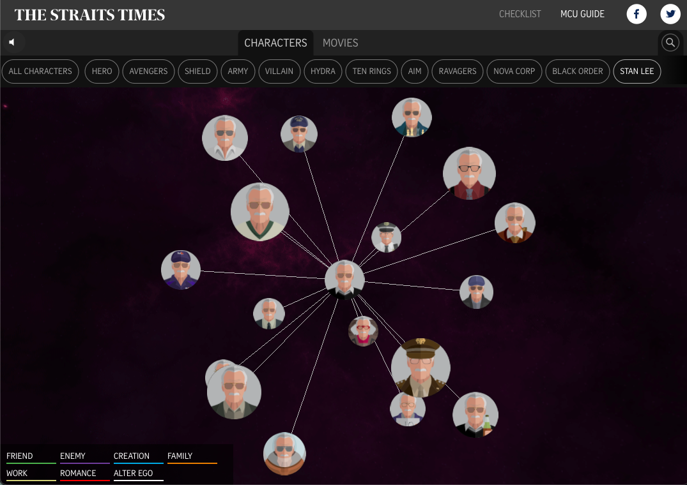

[A Who's Who Guide to the Marvel Cinematic Universe](https://www.nytimes.com/interactive/2017/11/07/upshot/modern-love-what-we-write-when-we-write-about-love.html?mc=adintl&mcid=facebook&mccr=blitzpush&ad-keywords=IntlAudDev&subid1=TAFI&_r=0)
===
Jyalu Wu

Thoughts
---
The viz I chose to reflect on this week is *"A Who's Who Guide to the Marvel Cinematic Universe"* by Billy Ker, Chee Wei Xian, and Denise Chong from The Straits Times, published on April 24, 2018.

This is an interactive visualization created 3 years ago that maps out the relationships between all the characters in the MCU that existed when the vis was published. The nodes of the network are vector images of each character, and the edges are colored differently depending on the type of relationship (green for friend, purple for enemy, blue for creation, etc). The graph is 3D so you're able to zoom in and rotate it. I thought it was really cool how they made that happen, instead of just having a 2D network graph. You can also filter out the type of characters you want to see in the graph - for example, only Avengers, only Hydra, or only Stan Lee cameos. 

Additionally, when you click on a node, the website automatically zooms in on it and a character bio pops up. The character's relationships are highlighted, and the characters they don't have any connection to are grayed out. This feature stays even when you zoom out or rotate the graph, making it easier to view the relationships.

In another page, the website shows a timeline for each movie released by Marvel. When you click on the movie, you are able to see the characters that are in it, and their relationships to one another. 

I thought that this visualization was really cool. It's pretty much a visual-based version of the [Marvel Wiki](https://marvel.fandom.com/wiki/Marvel_Database), which is purely information-based.

Future Improvements
---
To improve this graph even further, I think that when you zoom out enough, you should be able to see a name that summarizes each large cluster. The character pictures are really hard to differentiate when you zoom out a lot, so this could help with both clarity and exploration. Additionally, although the feature that keeps the relationships highlighted is very nice, the website should include a "back" button to go back to what the user was just looking at. This prevents any sort of frustration the user might feel when trying to find a specific character again.