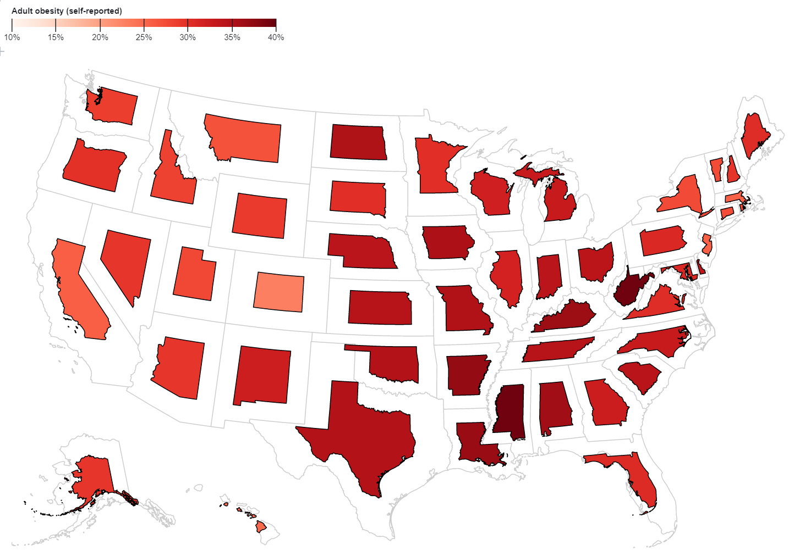
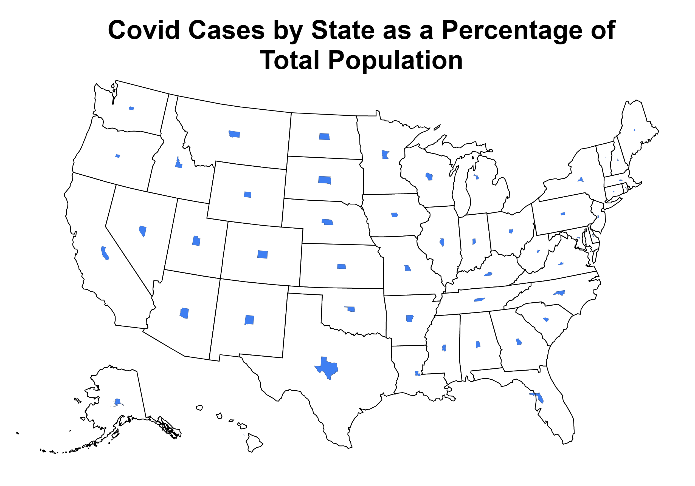

# Week 2 Reflection

Ryan LaMarche

Source: [https://observablehq.com/@d3/non-contiguous-cartogram?collection=@d3/d3-geo](https://observablehq.com/@d3/non-contiguous-cartogram?collection=@d3/d3-geo)

## Reflection

I found this Cartogram while browsing the d3-geo API and examples because I was curious about how people make maps in d3 using geoJSON data. The map shows the percentage of adults in each state that self-report as obese. I thought this was a really interesting way to view "percentages of a state's population." It is a little difficult to compare data points, since there is no alignment and the data is displayed volumetrically. This is why it's important to provide multiple encodings for the data, which can be seen in the color scale. States that are darker red have a higher percentage of self-reported obesity than states that are lighter red.

## Takeaways

It was interesting to learn how to make maps in d3 using the d3-geo API and making use of this Cartogram technique/style. I tried to build my own visualization this weekend using some of the same principles, but instead of obesity making use of COVID data. Below is a d3 viz I made in the same style as the one above. The data is total covid cases by state as a percentage of the total population of that state. This was an interesting challenge, because I had to combine data from multiple sources (CSVs and JSON files) in order to produce the map.

I never got around to implementing the color scale, so I am certainly missing the "multiple encodings." This makes the map quite hard to understand and compare different states, but it was fun to experiment with Cartograms and analyze some COVID data.

Source: Me [https://github.com/rmlamarche/covid-datavis](https://github.com/rmlamarche/covid-datavis)

