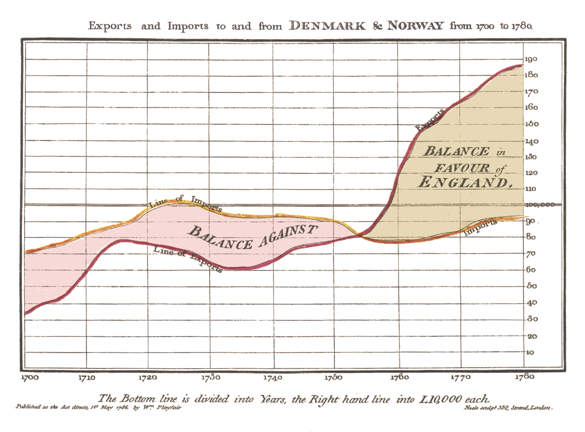

# Week 3 Reflection - [Invention of the Line Chart](https://upload.wikimedia.org/wikipedia/commons/5/52/Playfair_TimeSeries-2.png)

It's always interesting to look at charts from the past. The invention of some types of data visualizations seem so trivial, yet at the time, it was revolutionary in conveying the meaning behind data. One of the most well known inventors of visualization diagrams is William Playfair, also known as the founder of graphical methods of statistics. He invented the line, bar, pie, and circle charts which are used today.

Today's reflection reviews the first ever line chart: the Exports and Imports To and From Denmark & Norway from 1700 to 1780. This was published in his *Commercial and Political Atlas* in 1786. It represents the, as stated, the imports and exports between the years in 10,000 units. When the countries were importing more than exporting goods, the trade-balance was against England as represented by the red area. The yellow represents when England was exporting more than importing goods. In other words, it's a simplistic representation of trade-balance. Although very simplistic, it shows a marking point in human history where lines plotted across an axis can represent observable data from the real world. Not only that, it later went on to be used in graphing functions on axes, making it quite literally one of the first graphical representations of mathematics in the world.

## References
* [Willian Playfair](https://en.wikipedia.org/wiki/William_Playfair)