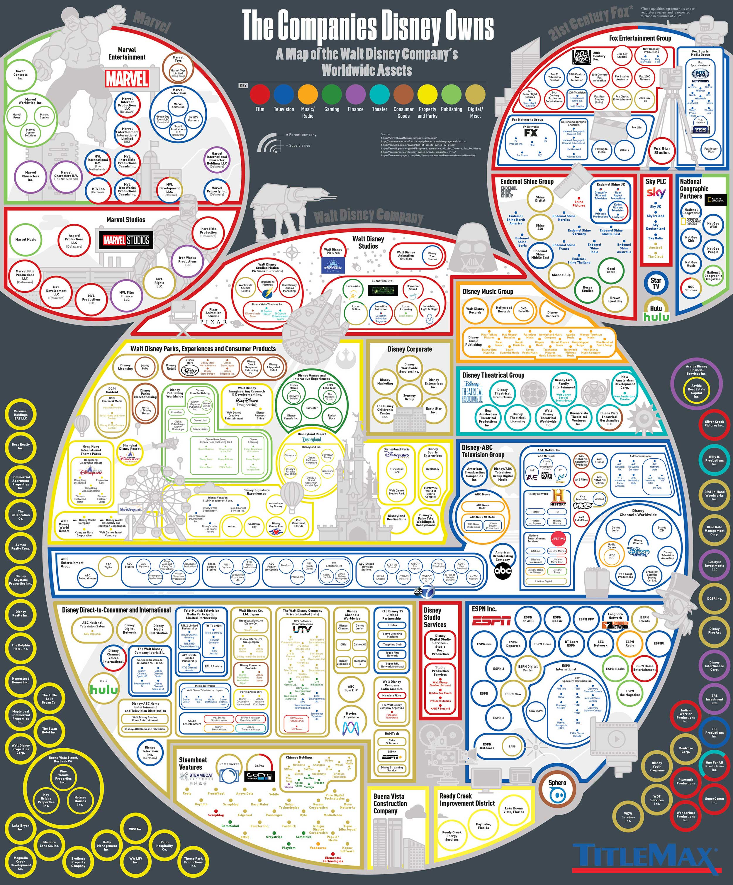

Week 3 - The Companies Disney Owns
===
By Andrew Nolan

Source: https://www.titlemax.com/discovery-center/money-finance/companies-disney-owns-worldwide/

It's common to hear stories on social media or in the news about how just a few super corporations control everything. This visualization provides an example of that. We all know Disney owns a lot of things, but this graphic allows you to really explore just how many things that is. The article discussing this map is also a few years old at this point, so we can expect that the Disney owns even more now.

Discussing the visualization, to start there are a few cool features I want to point out. Mapping all of the Disney products into the iconic Mickey Mouse shape doesn't provide any help for exploring the data, but it does provide a recognizable shape to help emphasize that all of these companies fall under the Disney umbrella. The main purpose of this visualization is to show the reader how big Disney is, while it does this goal well, it arguably obscures some other info. The cluster sizes seem to be based on number of subcompanies. This is fine for showing that Disney owns many products, but it obscures the value or relative size of the companies. National Geographic appears to take up a similiar, if not slightly larger, area to Star Wars, however Star Wars is valued to be worth over 25 times as much money [2][3]. 

Some other problems with this vis, the color scheme for the categories is not great. Running it through color blind software, several of the categories are indistinguishable and even without color blind tools the different shades, particularly of green, are hard to differentiate without the context of the company types. This mapping is also massive, it's easy to get lost in it as you have to zoom in to be able to read anything. A nicer zoom of mouseover feature would have been a good addition. 

That's not to say this is a bad visualization. The goal is to show the reader how HUGE of a corporation Disney is. The graphic is kind of overwhelming and at times unwieldy, but maybe that's the point.

Sources
---
1. https://www.titlemax.com/discovery-center/money-finance/companies-disney-owns-worldwide/
2. https://www.investopedia.com/articles/investing/102215/why-star-wars-franchise-so-valuable.asp
3. https://www.washingtonpost.com/lifestyle/style/peril-cited-in-national-geographic-sale-not-evident-in-financial-disclosures/2015/09/11/456049de-589d-11e5-b8c9-944725fcd3b9_story.html
