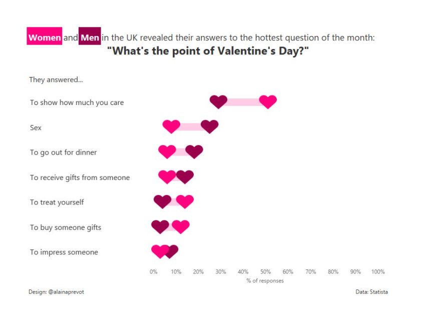
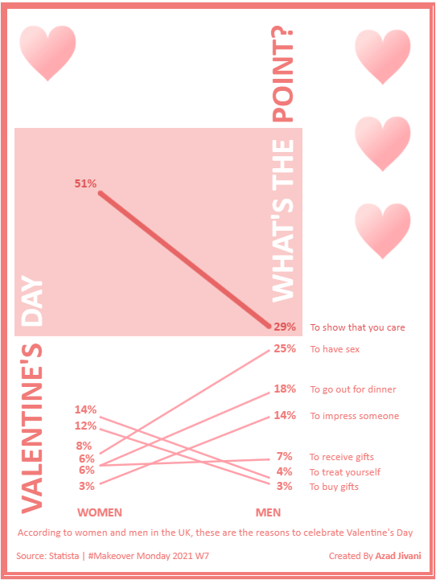
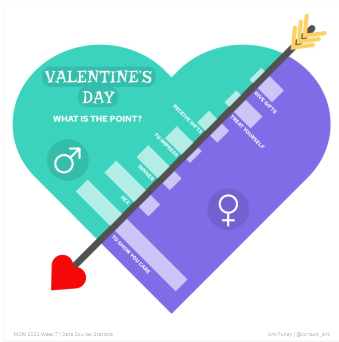

## Week 3 Reflection

So as I was looking through Twitter, I found these 3 Valentine's Day visualizations that all showed the same
information but in different ways. I think it was part of a data visualization challenge of some sort, but 
overall it was interesting to see the effectiveness between each one.

[Link to the first visualization](https://public.tableau.com/profile/alaina.prevot#!/vizhome/MakeoverMondayWeek7-WhatsthepointofVDay/WhatsthePointofVDay)

With this first one, you can clearly see that most people answered that the point of Valentine's day was 
"to show how much you care" between both men and women. When I had first initially saw the visualization,
I didn't even realize that there was a difference between the men heart and the women heart. I saw the different
colors but it just didn't occur to me. I do like how they highlighted the text based on the corresponding
color though, and that they fit the theme to Valentine's Day. It's hard to distinguish the actual percentages for most of the other reasons after "To show 
how much you care". 

[Link to the second visualization](https://public.tableau.com/profile/azad.jivani#!/vizhome/MakeoverMonday-2021W7ValentinesDay/Viz)

For the second one, I thought it was way more effective to see the percentages and the differences between
men's and women's answers. The colors still stuck to the them of Valentine's Day, and the designer utilized 
the thicker line effectively to show the difference between the percentage of women and the percentage of me that
answered "To show that you care". It is a bit confusing because to see the reasons for the women's percentages, 
you'd have to trace through the men's side. Overall, I thought this second one was more effective than the first.

[Link to the third visualization](https://public.tableau.com/profile/ant.pulley#!/vizhome/ValentinesDay-WhatisthePoint_16137595808010/ValentinesDay-WhatisthePoint)

Finally for the third one, I really liked this one and how it was presented. It still stuch to the theme and
displayed the percentages effectively. I think it would have been nice to have written out the percentage because it's
hard to acutally gauge the difference between the lengths. Indicating the reasons is pretty easy as well.

