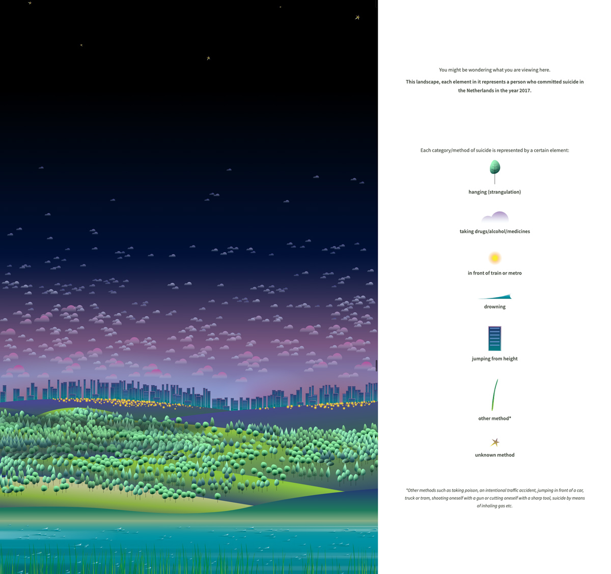

# Week 3 Reflection - A View on Despair
## Resource link
[A View on Despair](https://www.studioterp.nl/a-view-on-despair-a-datavisualization-project-by-studio-terp/)
## Introduction
Not many people can manage to create beautiful things with unfortunate data and information. It’s especially impactful when the data artist has a personal story and reason behind their visualization.

A View of Despair is a beautiful visualization by Sonja Kuijpers. It tells the story of all the people who took their life in The Netherlands in 2017. Each natural symbol represents how life was lost, along with the size representing age. ALso, there are several line charts to show trend of the amount of suicides, methods of suicides, and suicides per agegroup.

Sometimes, the best data visualizations are the ones that tell a personal, relatable story. 

In addition, Sonja Kuijpers visualized the data of suicides in a beautiful as well as peaceful way, which also showed his respectful to those who took their life. And for the viewers, this is kind of like a memorial. Thus, I think for different kind of data set, it could be better if the style of design can be related to the theme of data. In this case (A View on Despair), the humanistic care showed in design makes the visualization more impactful. 

