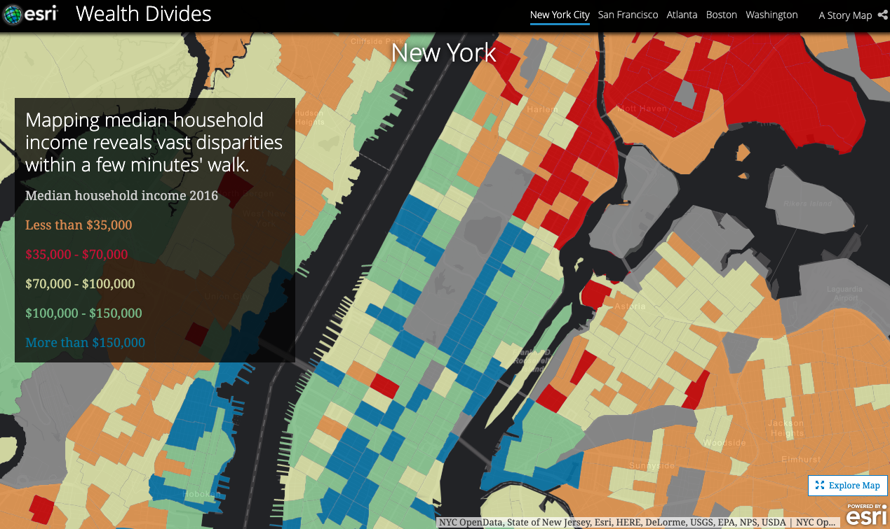
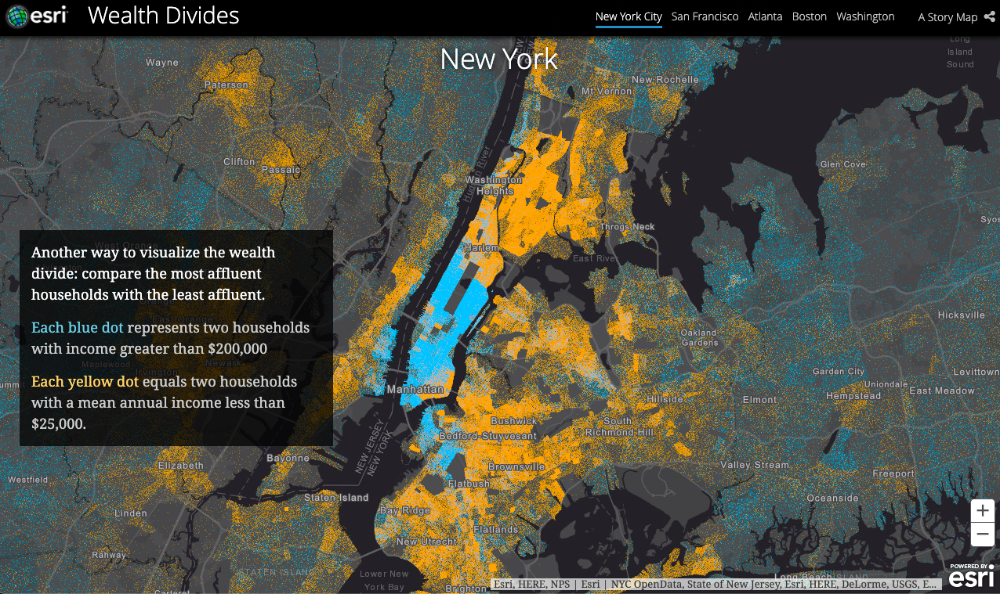

[Wealth Divides](http://storymaps.esri.com/stories/2016/wealth-divides/index.html)
===
Jyalu Wu

Thoughts
---
One of my roommates is a civil engineer and coincidentally, is auditing this class. We've recently had some very thought-provoking conversations about income inequality, red-lining, and gentrification, and how all of that can also relate to race. I wanted to learn more about these topics, so I turned to Google for answers. More specifically, I wanted to know how others had analyzed income inequality, how they visualized it, and how they were able to draw conclusions from it or propose any suggestions (if any) that addresses the problem. The first visualization I found was *Wealth Divides* created by ESRI, a GIS company.

The data visualization is a story map with a bunch of visualizations that all tie into each other. In the beginning, the story map gives a short history lesson on income inequality throughout history and shows how many areas have seen a decrease in the size of their middle class. Next, the story map goes through 4 case studies on cities with some of the highest income inequality (NYC, San Francisco, Atlanta, Boston, Washington DC). For each city, they first show a map of the median household income. Next, they compare wealthy households to poor households on a map, showing each household as a dot. These visualizations were very educational and I learned a lot from them.

Areas for Improvement
---
The orange-red-yellow-green-blue color scheme of the median household income map was hard to follow. This is especially the case when orange, not red, was picked to represent the lowest income. I think that if they used a color-gray scheme like red-gray, with red being the lowest income and gray being the highest, the divisions would've been much easier to understand.

I felt like the visualization comparing individual households was rather difficult to navigate and comprehend because the underlying map still contained roads and state lines. The background was also gray, which made the blue less able to stand out.