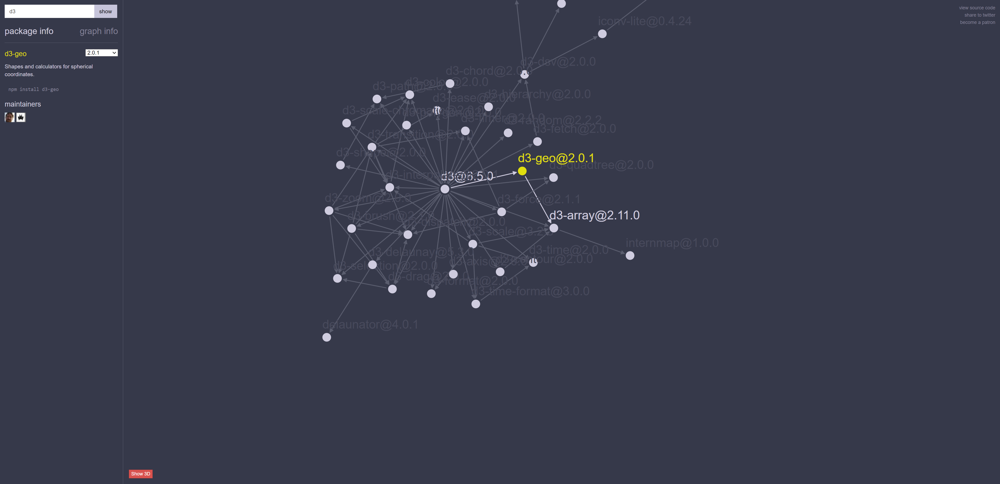
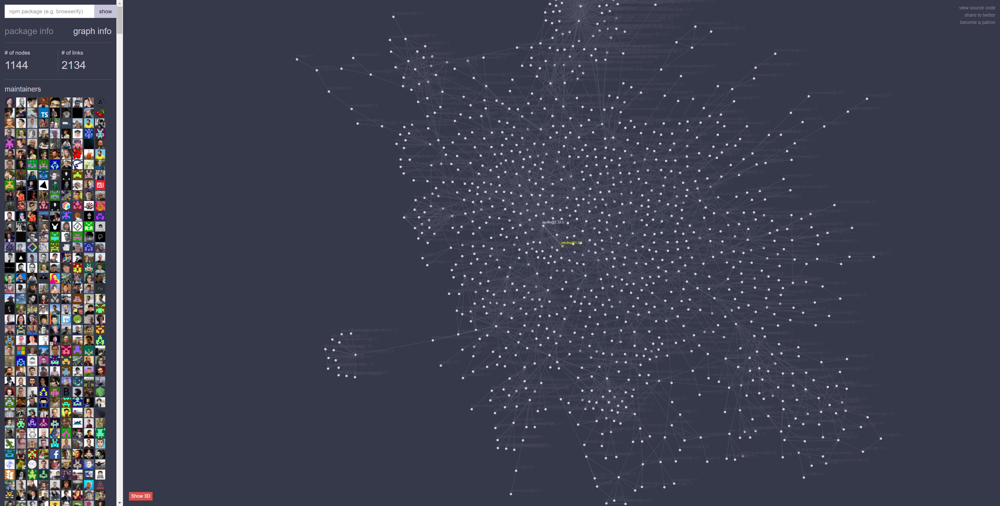

# Week 3 Reflection

Ryan LaMarche

Source: [https://npm.anvaka.com/#/view/2d/d3](https://npm.anvaka.com/#/view/2d/d3)

## Some Context

This is a visualization of npm dependencies for the d3 js library. "[npm](https://www.npmjs.com/)" is a Node.js package manager/registry/CLI tool. It enables Node.js developers to easily install community-published packages (such as d3), pin versions of those packages as dependencies for their projects, and create (relatively) reproduceable environments.

## Reflection

This is a visualization made by github user "Andrei Kashcha (anvaka)." I found it on Twitter months ago, and luckily I was able to find it again because I think it's a really fascinating "problem space." Open source is a beautiful thing, but as dependency chains and graphs grow larger, it can lead to some inherent trust issues. People install libraries that will help them solve their problems and build web applications, but when you `npm install d3`, what are you getting? With a package like `d3`, nearly 100% of their dependencies are internal and made by the organization that maintains `d3` (Screenshot 1). But when you install a library like the `vue.js` official CLI tool, you get 1,144 packages in a very interconnected graph (2134 links/dependencies).

I think this visualization is interesting because it highlights the complexity of open source libraries and their dependencies. I've never made a visualization using graph data structures, so this is definitely something I would like to try in the future if I have the opportunity.
