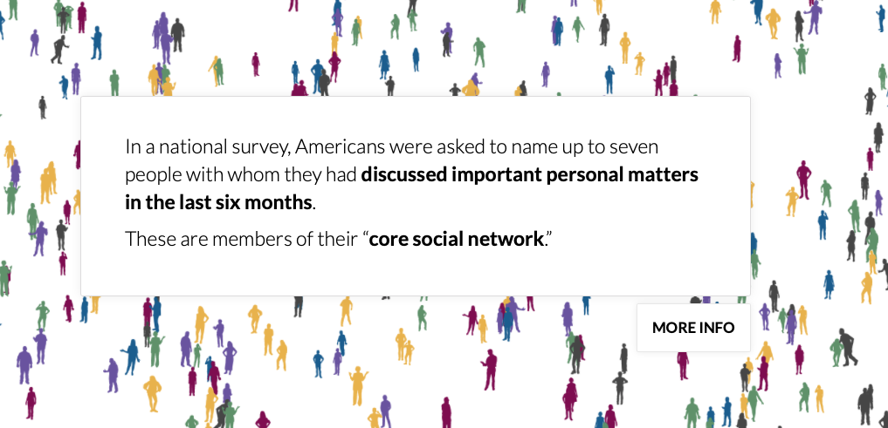
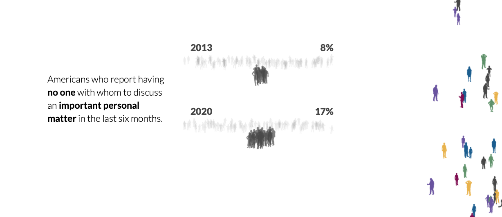

Week 3 Reflection
===

Author
---
Joseph Yuen

References
---
- [American Storylines](https://www.americansurveycenter.org/american-storylines-project/)

Reflection
---
From the same company that made my previous reflection's data vis, Periscope, I present American Storylines, a data driven story about our political and social divide.

I chose to look at another Periscope project as I was fascinated by their work to drive social change through data vis. Although there are ethical concerns about whether they are making unbiased visualizations or straight up propaganda, I am fascinated by their diversity of projects that use interactive visuals and data to tell socially relevant stories. While the vis in my previous reflection had more interactive data, the American Story lines vis contains simple charts that are surrounded by a linear story line. 

Upon entering the site, there are many small chunks of text that get the user thinking about the topic of social and political division in America.

Although there aren't explicit visualizations in these paragraphs, they provide context information. They prep the user so that they can more easily understand the data. I think this is again a lesson in making visualizations that are appropriate for the target audience. This vis was made for the Survey Center on American Life which means the client likely wants to communicate to the American public which is a relatively large and diverse audience audience. As a result, the creators must take into account low knowledge users that may not be familiar with social divides. You can also see in the picture above that there is a "MORE INFO" button that provides context to the presented topic for those interested. The relatively simple color scheme consisting of a white background and multi colored people also contributes to the vis' PSA style message.

After a bit of scrolling past the context information, the user is presented with various charts as seen below. These charts are accompanied by text blocks to present various conclusions. Although the graphs are relatively simple, they contribute to the straight forwardness of the message. At first glance, I noticed the lack of alignment in the lines of people. Even though there was a percentage describing the amount of people affected by the presented statement, I wanted to see the lines aligned to the left or right in order to more easily compare them.

I also wanted to talk about the vis' use of color and animation. I already mentioned the simplicity of the vis, but I also noticed how the background moves away to provide room for the next vis or paragraph. Even though this point is minor in my opinion, it is a reminder to decrease visual clutter in order to engage users on certain points and not confuse them. In addition, I liked how the vis used colors from previous vis'. In the pictures below we can see the differentiation between Republicans and Democrats through the use of colors red and blue. Then in the second image, we see the combination of red and blue as the vis describes politically diverse networks. The use of gray for "politically similar networks" may also be tactic to attach a negative connotation towards that group.

Overall, I found the vis to be simple yet focused in its message. I think that its use of color and text provide context information and drive a narrative that hopefully persuades Americans to talk to one another.