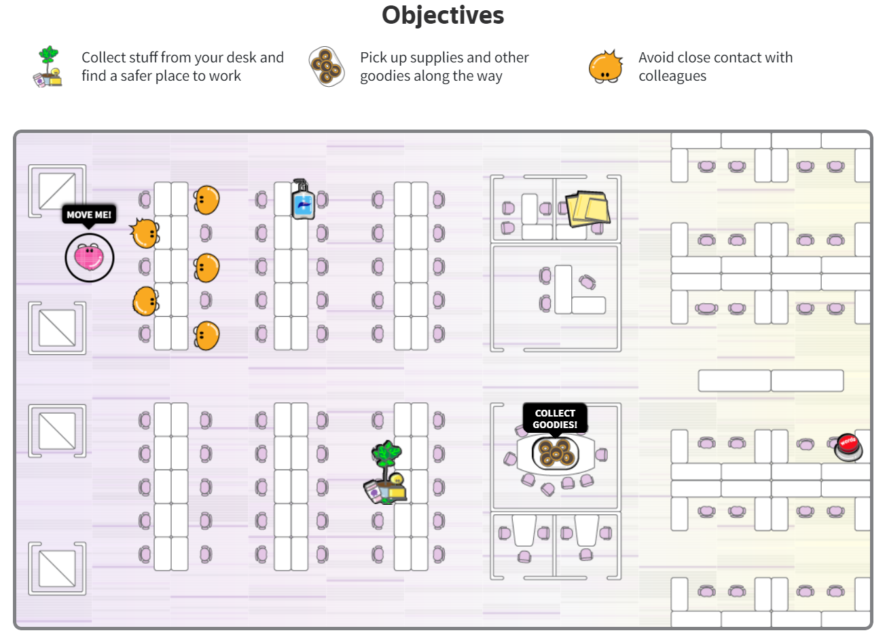

# Week 4 Reflection - What will it be like when we go back to the office?

## Resource link: 

https://graphics.reuters.com/GREAT-REBOOT/OFFICE/xlbpgdyjzvq/

## Introduction

Some people are sick of working from home, but the office they remember is very different from the one they will return to. To understand what that might feel like, Sarah Slobin and Feilding Cage visualized it with an interactive game.
They spoke to some experts on work and workspaces who predicted that social distancing measures and hybrid work models are here to stay. Users can walk through their simulations to experience what going back to the old/new office might be like. 

## Reflection

This visualization is very creative and enjoyable. It's both a visualization and an interactive game. By playing the game, users can understand the visualization better. Without doubt, a game is easier to accept than simply data and charts. In addition, the color used in this visualization is also very eye-catching, which makes the game more addictive. Sometime we can make the best use of 'enjoy' to have the most effectiveness.

