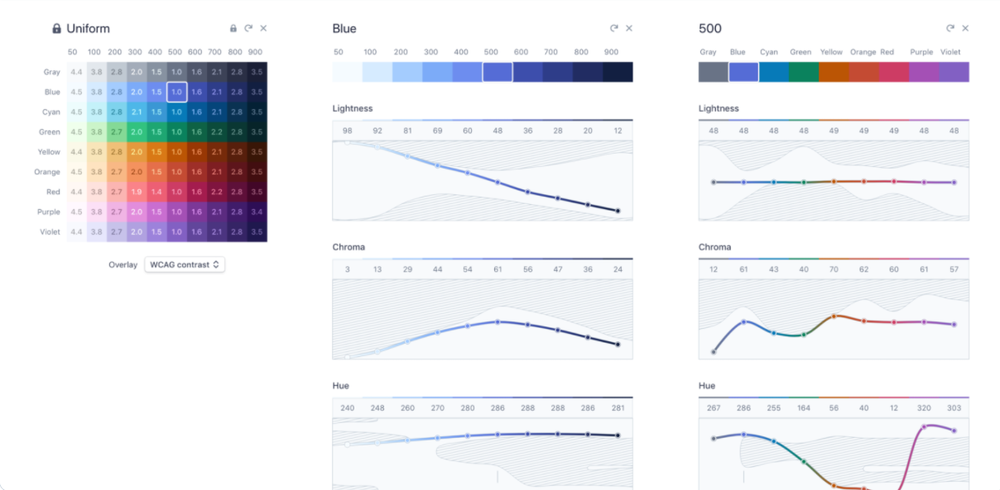

# Week 4 Reflection

Ryan LaMarche

Source: [https://stripe.com/blog/accessible-color-systems](https://stripe.com/blog/accessible-color-systems)

## Reflection

This is a blog/article written by design engineers from Stripe in 2019 (Daryl Koopersmith and Wilson Miner). The post focuses on their color system and choosing accessible colors that still "look and feel good." Stripe's old design system failed to meet modern constrast standards for the web, and their goal was to solve this problem. They mostly focus on color contrast with light and dark backgrounds in small and large text sizes. They go into some detail over the different color spaces (RGB, HSL, Lab), and discuss why making colors "lighter and darker" in RGB (and even HSL) comes with many challenges because the lightness in these color spaces is not perceptually uniform. For this reason, they wanted to use the Lab color space, since its lightness dimension is perceptually uniform.

The Stripe design team built an internal interactive web tool that allowed them to visualize and manipulate their brand colors using Lab. The graphs showed them for each particular color what the effects of changing the lightness, chroma (saturation), and hue would be in terms of contrast. I really like this blog post and visualization because they used data viz as an interactive tool to augment their work and better understand the changes they were making to their color system. It's really hard to "visualize" color contrast and accessibility of colors, but by framing the problem around perceptual lightness in the Lab system and building charts to visualize the data, it allows us to see the "boundaries" of the color system. Changing the hue of a color will have an effect on the accessibility boundaries for the lightness and chroma dimensions, and this tool allowed them to immediately see and understand that.
