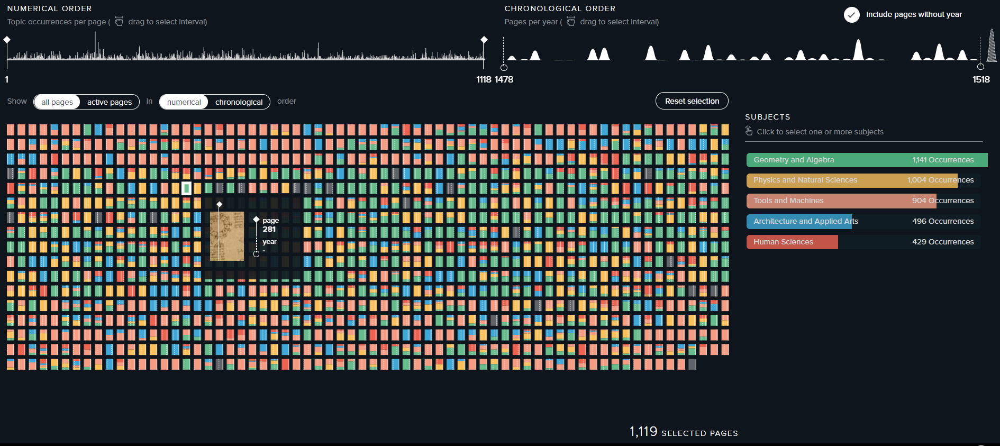

# Week 4 Reflection - [Codex Atlanticus](https://www.codex-atlanticus.it/#/)

Going to the modern day of 2020, we have the *Codex Atlanticus*. This is simply an online searching visualization containing the drawings and text of Leonardo da Vinci which is currently preserved at the Biblioteca Ambrosiana in Milan. Each page is shown as some colored rectangle. The pages can then be filtered by numerical or chronological order using the sliders above, the associated subject, and a topic within that subject. The filter results can be seen in each option to be chosen. If a specific page is clicked, it will show the contents of the page including a selector to choose whether to view the front or back. It will also show the generalized category information associated with the paper along with other similar pages.

The design is quite elegant and sleek; however, the page itself has some issues. If the screen is two small, it will automatically show just the background with no visualization. Another note is that the data is loaded very inefficiently at once causing the visualization to lag if all pages are on the screen. While not major, it would provide a better view of the visualization to view and would greatly benefit user experience.