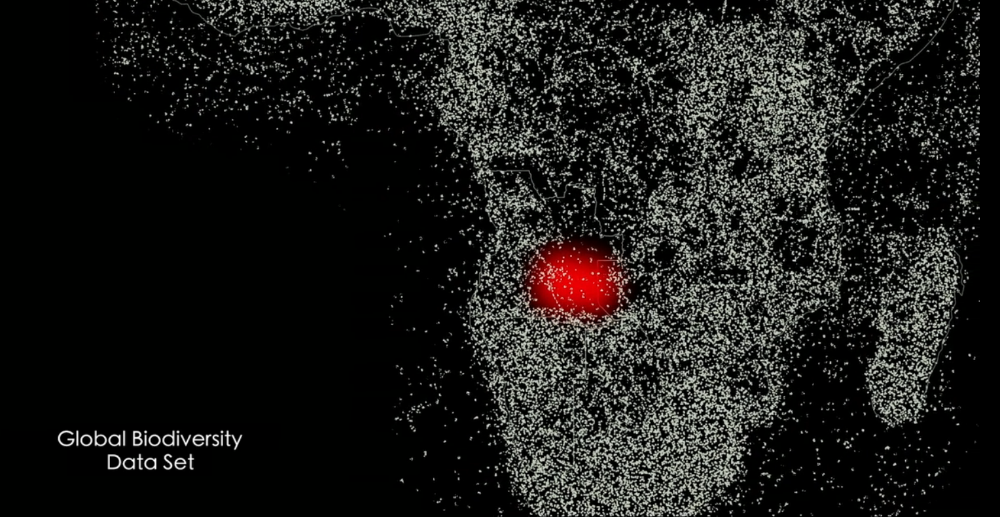
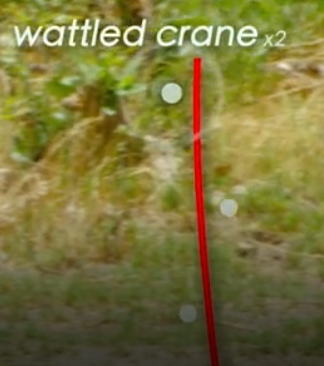
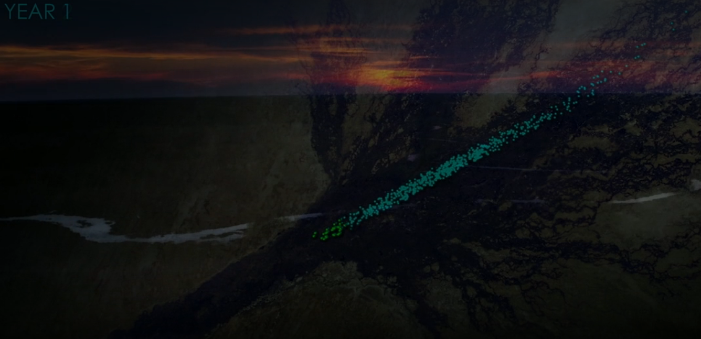
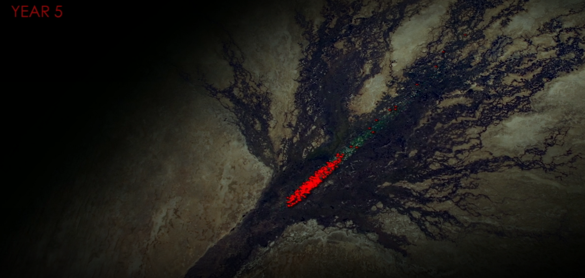
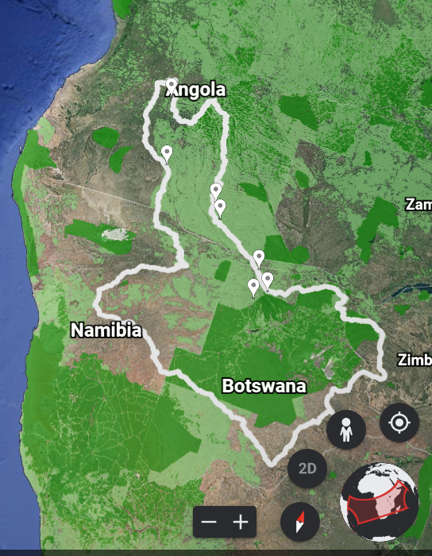
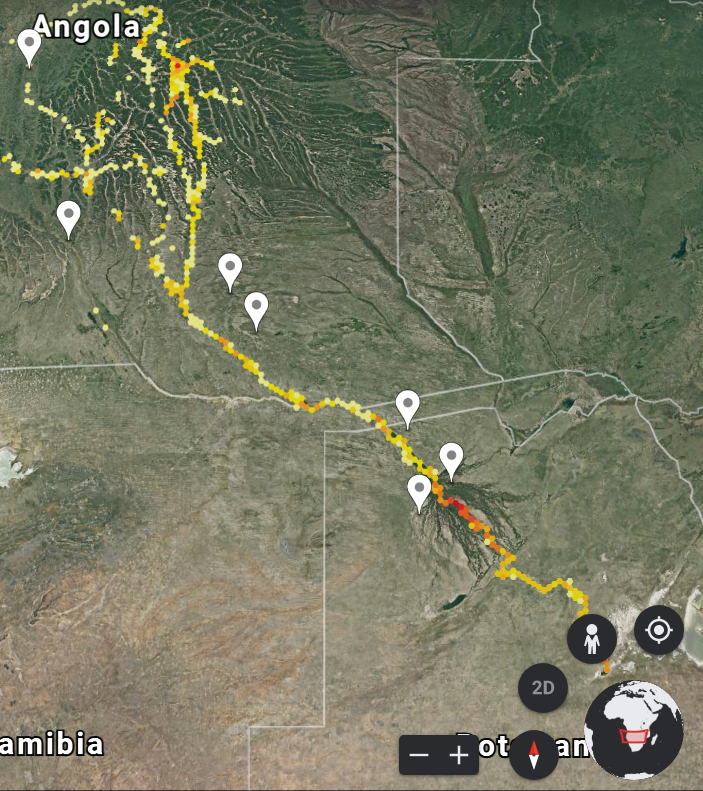
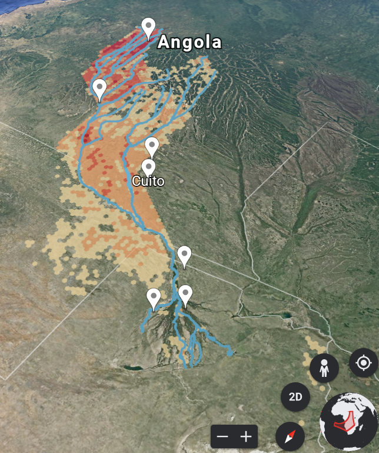

Week 4 - Into the Okavango
===
By Andrew Nolan (3-1-21)

[A map of Africa showing the areas where wildlife has been surveyed. The Cuito river area is laregly unexplored.]

Last week in class I shared my reflection on a visualization of companies that Disney owns. The discussion turned to National Geographic, and Professor Harrison mentioned the movie *Into the Okavango* on Disney Plus. He said that it was a great documentary and also had cool visualizations in it. So I decided to check it out this week.

The movie follows several biologists and their guides as they travel down the remote Cuito river, the primary tributary to the Okavango Delta, in Angola on a quest to see if they can determine why the Okavango Delta is running dry. The expedition was largely successful and resulted in geotagging over 30,000 animals, discovery 38 species unknown to Angola, and 24 species potentially never before seen by science. As a documentary it was engaging and well shot. Watching it through the lens of this class I paid attention to things I otherwise would have overlooked, or potentially not thought of as data vis, even though now I clearly know they are. 

For example, throughout the film they show little images like the one below. This line represents the path they followed down the river and the dots and captions say when a bird was spotted. A major goal of the expedition was to spot birds, because birds have the easiest ability to migrate, so if an area is deprived of birds that's a bad sign. This data vis doesn't say much but it helps the viewer understand the lack or plentiful amount of birds in the different parts of the journey. Seeing more in the lush parts and less in the dried out areas.

Around 18 and a half minutes into the movie, there is another example of bird data. This time with an animation and overlay showing the decrease in bird spottings in the Okavango Delta annually over five years. Although, the first year happens in a scene transition and is harder to read, it's still clear that the bird population is dwindling over 5 years.

Beyond the movie, the Okavango project also features an interactive Google Earth page with several visualizations [3]. The first shows a map with an overlay depciting human impact on nature. It uses a saturated green scale to show the level of impact. Suprisingly/confusingly to me, the more vivid green meant lower human impact. Showing again, that the Cuito river is unexplored.

Another interesting Google Earth visualization they shared includes a graph of wildlife density. This ties back to those bird sitings we talked about earlier. Here it uses a color gradient scale from yellow to red, red being the most wildlife spottings. You can see that in the lush delta areas more animals are spotted. It also is intersting to see the points plotted along the river in this way. 

The final visualization I wanted to share is the fire risk levels of the basin. This time it uses a saturated red scale to show levels, with the most red areas being the highest risk. Interestingly, although not perfect, it seems to show a somewhat inverse relationship with where the wildlife spottings occured. This makes sense as the animals likely go to lush areas and the fires occur in dry areas. 

This documentary and journey has a lot of interesting visualizations throughout that are used to help tell their story. I think it was interesting to see how they overlayed visualizations on actual maps/landscapes as opposed to the sort of cookie cutter maps we usually see of the U.S. States. Plotting points along a river also allowed for interesting depictions of salience and understanding of the environment surrounding the river that a normal map can not show with a small blue line. Finally, I think this was appropriate to look at after the color lectures because a lot of these visualizations use color as their primary mark for the data.

If you are reading this and haven't seen it yet, I'd encourage you to check out this movie.

Sources
---
1. *Into the Okavango* (2018)
2. https://www.nationalgeographic.org/projects/okavango/
3. https://g.co/earth/okavango
