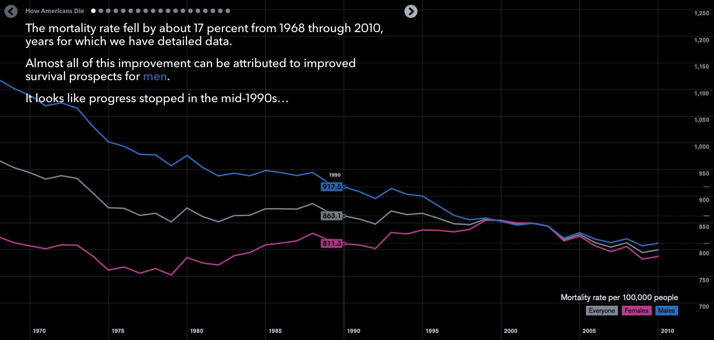
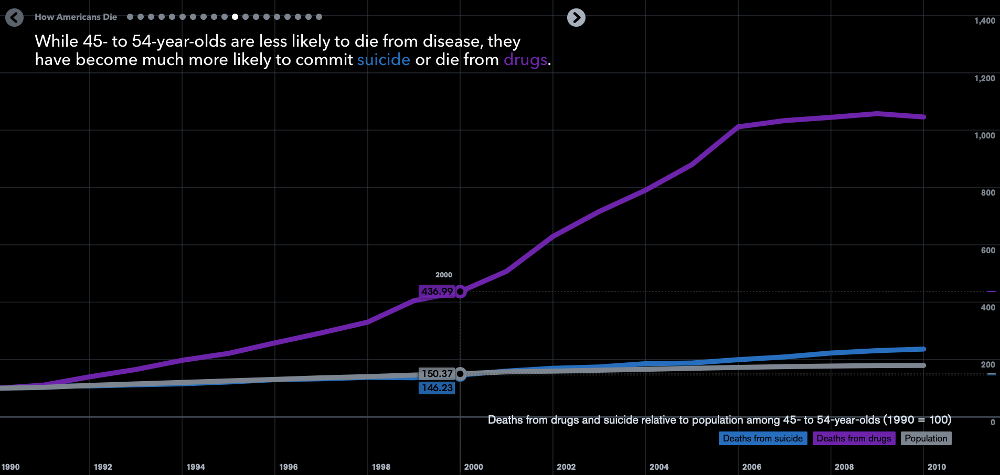
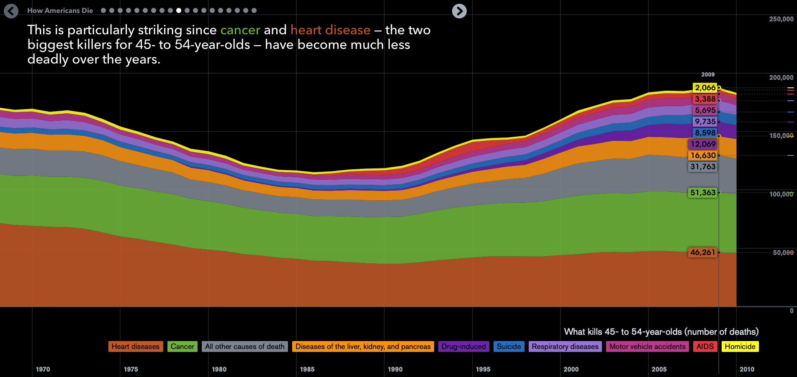
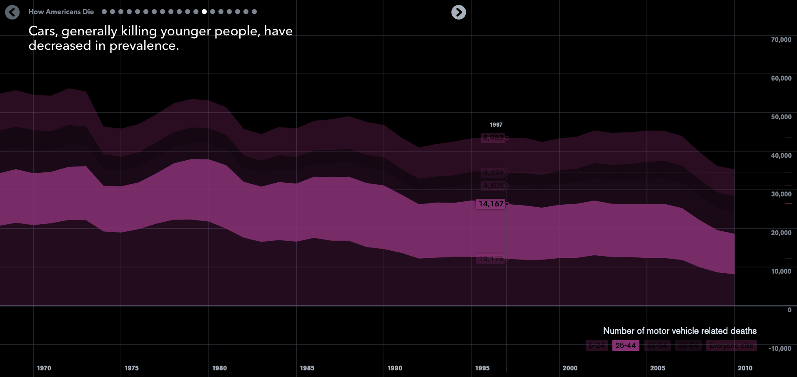
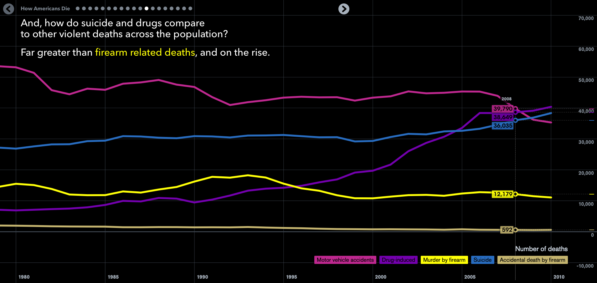
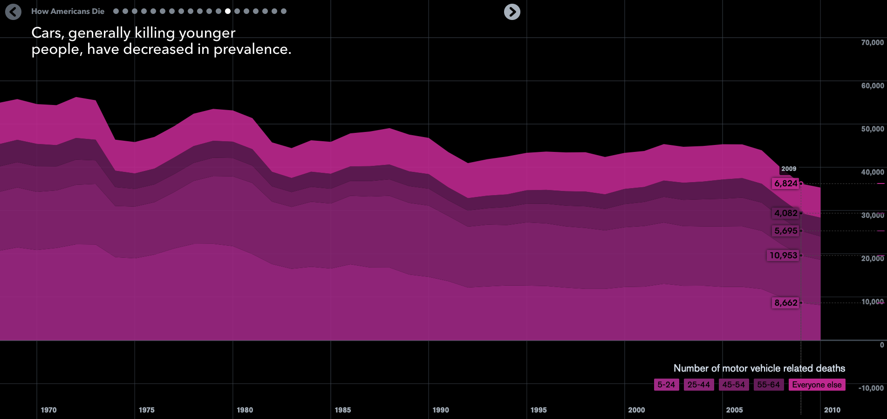

Week 4 Reflection
===

Author
---
Joseph Yuen

References
---
- [How Americans Die](https://www.bloomberg.com/graphics/dataview/how-americans-die/)

Reflection
---

In this reflection, I examine "How Americans Die" by Matthew Klein and Bloomberg. Even though the topic is a bit morbid, I found the vis to be interesting to study. The viz consists of multiple interactive graphs that follow a linear narrative.

In previous reflections, I have talked about using text to provide context and narrative to visualizations, and this vis is no exception. Each new graph tells a different story that contributes to the overall theme of how Americans die. This technique allows the user to prove to themselves why the claim is accurate which hopefully increases the chance of persuading the user to specific claims.

Similarly to my most previous reflection, the vis uses colored text to refer to specific lines in the graph. I thought that this feature exhibited the concept of visual popout.

I found this to be especially helpful when looking at very complex datasets with many categorical variables as seen below. I also thought that the image below demonstrates how having too many categorical variables represented by color can be overwhelming to the user. Although "Drug Induced" and "Respiratory Diseases" are two unique colors, they are both shades of purple which may be problematic to some users. To solve this issue, perhaps the developers could have separated internal causes such as disease from external causes such as "Homicide" and "Suicide." 

To also provide visual popout and provide perhaps a solution to having so many categories, users can select a category and focus on that specific section as seen below.

I also appreciate the use of animations to also show context. For example, the picture below transitions to the picture below it by expanding the x axis, keeping the y axis, and then drawing the pink shapes over the existing graph. Since the pink line exists on the first view, the user can more easily understand how the second view fits in the context of the first.

Lastly, I noticed how the axis are not labeled. Typically, I would recommend labeling axis as to not confuse the reader. But in this case, I found it relatively easy to infer what each axis represented. It goes to show how labels are helpful but not always necessary.

In conclusion, I found this vis to be impactful through its use of text, color, filtering features, and animations. As I continue to analyze various visualizations, I notice that persuasion through data visualization requires much UI/UX design to make the user adopt the given message. As I like UI/UX design, this excites me and makes me want to make visualizations.

