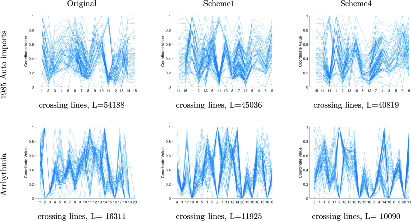

Week 5 - Genetic Algorithms to Improve Parallel Axes Plots
===
By Andrew Nolan

For this next week of lecture we need to read chapter 7 from the Visualization Analysis and Design textbook. In this chapter they discuss lots of common ways to convert tabular data into basic visualizations. I found it very interesting to read about parallel axes graphs. Partially because I needed to build a tool that makes them as part of my MQP, but also because they are fasicnating way to display the relationships between many qualitative attributes, only truly limited by the width (or height) of the display. I think this makes them a very powerful exploratory tool for highly featured data. The problem is, as the number of features increase and the lines begin to overlap, the graph becomes very difficult to read and understand. According to [1], a common approach to improving the readability of parallel axes plots is to initially arrange the axes to reduce crossing lines. While this is in theory a simple combinatorics problem, with possible dozens or hundreds of features, it can be difficult to decide what order to display these in.

Published in the IEEE *International Conference on Systems, Man and Cybernetics*, Khiria Aldwib, Shahryar Rahnamayan, and Amin Ibrahim did research into this question by using a genetic algorithm [1]. They based their parallel axes fitness metric on the number of overlapping lines. They state that this genetic algroithm fitness measure could be changed to any of the user's choice. The developed genetic algorithm used a "smart mutation". This mutation when applied swapped the two axes that produced the most crossing lines. In the figure shown at the top of this reflection, you can see the original parallel axes compared to a standard genetic algorith as well as scheme4, the genetic algorithm with a smart mutation. As can be seen in the two examples above, their genetic algorithm with smart mutations improved the fitness (to use a genetics term) of the plots.

This research is really cool. As simple as it sounds, it's interesting to think about how just changing the order features are displayed can greatly affect the usability of a visualization idiom. Especially with parallel axes, changing the order of features to make it more readable and make the correlations more clear is a huge plus. It can be difficult for a human constructing the vis to figure this out themselves, so it's nice that computers can do that for us. It's also really fun to see how vis interacts with other CS disciplines, in this case AI.

Sources
---
1. Enhancing Parallel Coordinates Visualization Using Genetic Algorithm with Smart Mutation: https://ieeexplore.ieee.org/abstract/document/9282852/