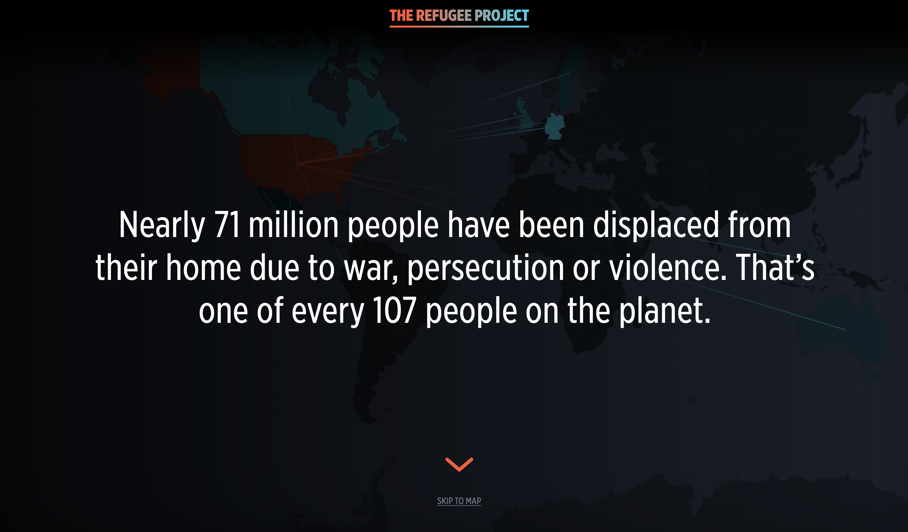
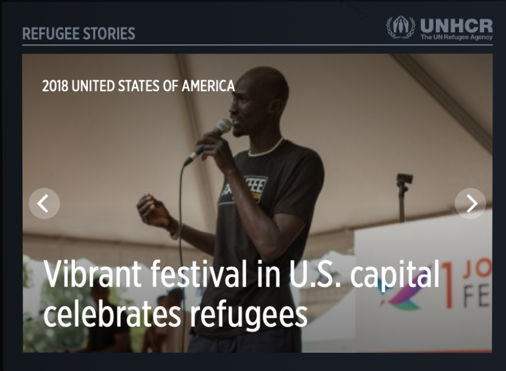
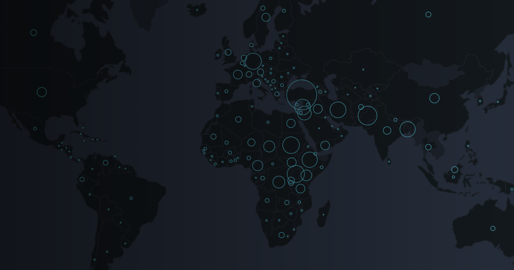
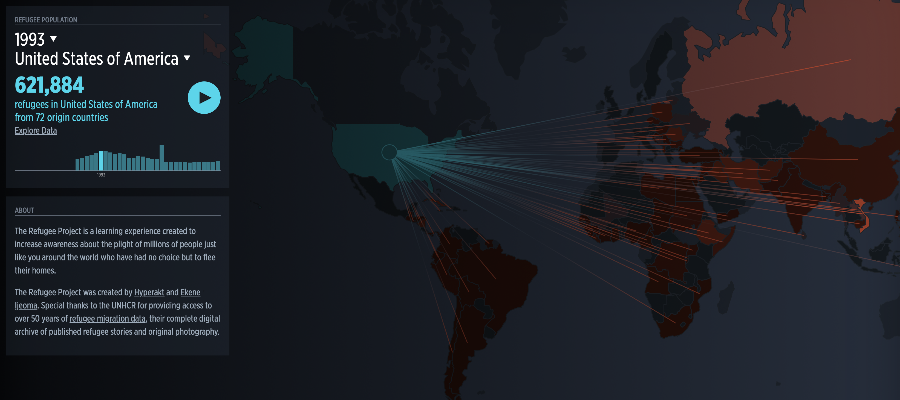
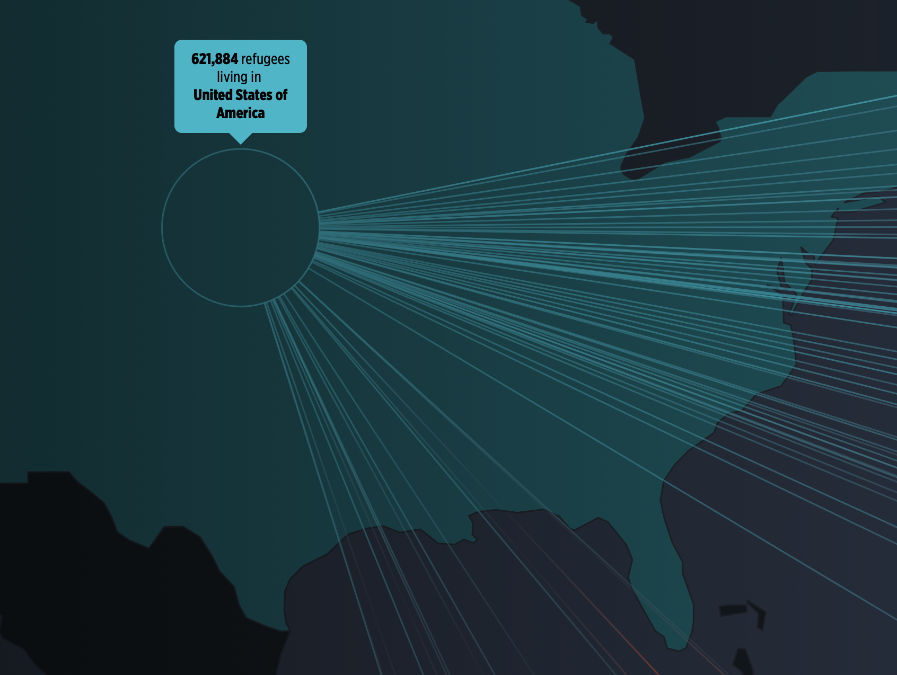
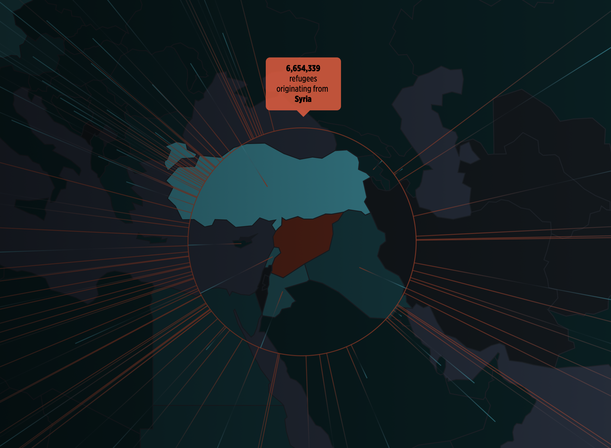
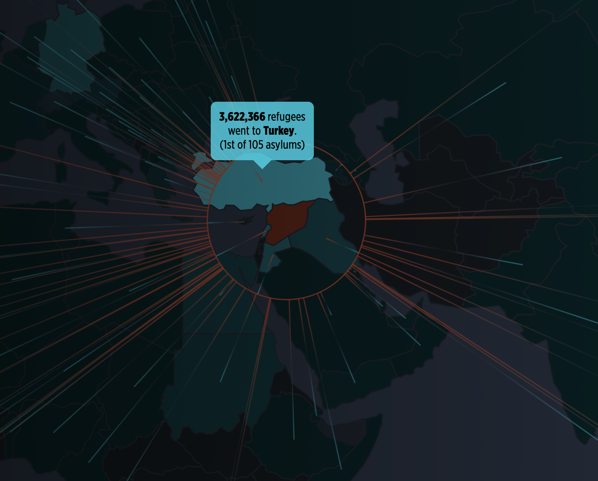
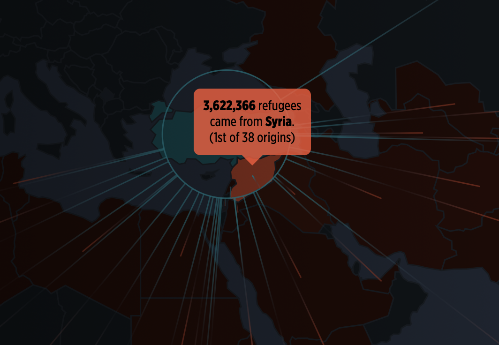

Week 5 Reflection
===

Author
---
Joseph Yuen

References
---
- [The Refugee Project](http://www.therefugeeproject.org/#/2006/USA)

Reflection
---

The Refugee Project is a data visualization depicting the distribution and movement of refugees over the past few decades. It uses a variety of techniques that I have discussed in previous reflections and new ones that offer new insights. 

Like many narrative focused visualizations, this one opens up with a series of sentences that provide context to the world's refugee situation, as seen below. This is important as it clears up any misconceptions about the data and makes the experience less academic and more enjoyable in my opinion. 

After the user progresses through the context information, the user sees the world map. From this view, the user can see geographical, spatial information but also various links to real life stories as seen on the bottom left. After selecting on a country, the user can see relevant news stories for a given time period related to the country's refugee situation at the time. This is an excellent feature as it allows the user to continue doing research outside of the program if they so choose. 

In addition, there is a filter option in the top left corner of the screen that enables the user to see the distribution of origin countries and asylum countries. I found this binary filter to be the vis' best feature as it was easy to understand, color coded, and each of the filters offered new insights.

Upon entering, I liked how the circles marked higher numbers of exiting refugees as seen below. This initial view allowed me to observe from a more abstract level and drill down. This layered system seems to be part of other visualizations that want the user to explore the data on their own. In addition, the vis offers a play button for a given country or the world which shows the various distributions of refugees over the years. This is just another method to help users explore the data and discover new insights without having to be prompted.

After a user has selected a country, the vis also offers a hover feature that allows for additional drill down capability. The presented tool tip changes based on if you are in the "Origin Country" or "Asylum Country" mode and whether or not you are hovering over the country selected or a country that is connected to it. For example, if I select the US in "Asylum Country" mode and hover over it, then I can see how refugees are living in the US. But if select Syria in "Origin Country" mode and hover over it, then I can see how many refugees originate from there. And if select Syria in "Origin Country" mode and hover over Turkey, I can see how many refugees from Syria went to Turkey and its respective ranking to other Asylum countries related to Syria. If I select Turkey in "Asylum Country" mode and hover over Syria, then I can see how many refugees came from Syria and its respective ranking. I found this feature to be an extra detail that made the experience all the more educational. I do wish, however, that the rankings could have been displayed in a list format to also encourage additional research and exploration.

Overall, I found the use of the two colors and then shades of that color to be extremely effective. By using two colors, it made the vis easy to understand, and by using various amounts of saturation, I was able to distinguish a quantity rather than a category. I am also impressed with this vis' ability to encourage exploration in an easy to understand manner which makes the user care more about the refugee situation in the world. I hope to mimic the layered exploration system and storytelling that this vis exhibits.