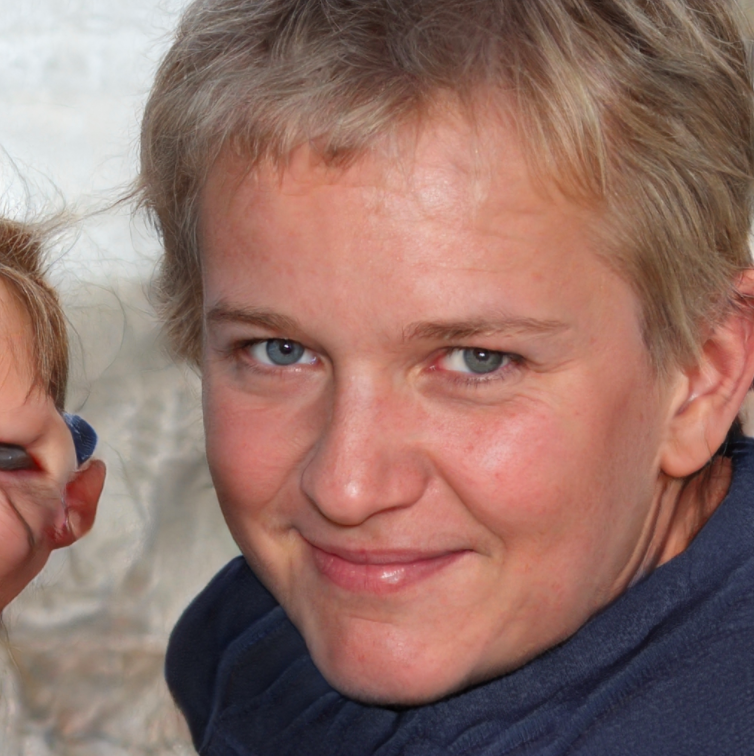

[This Person Does Not Exist](https://thispersondoesnotexist.com/)
===
Jyalu Wu

Thoughts
---
One of my other professors briefly showed this in class because we were learning about neural networks. When you refresh the website or press the "Another" link, it shows a picture of a new person who does not exist. This person is actually an image generated and imagined by a [generative adversarial network (GAN)](https://en.wikipedia.org/wiki/Generative_adversarial_network), which I thought was just incredible. It's crazy to think that a computer generated such a life-like image of a "person"!

However, some of the images on the website are a little funky looking, so the model still isn't perfect. In addition, there seems to be a significant bias towards generating pictures of white people - mostly middle aged men and young adult women - I've refreshed the page dozens of times and have yet to see any black or south Asian representation. There are east Asian "people" being generated, but I have only seen two young east Asian women with stereotypically small eyes. It's a little disappointing to see the lack of representation in this model, but there's always room for improvement!

Example of a funky looking picture:

Learning About GAN
---
In a GAN, two neural networks are pitted against each other in a zero-sum game - one network's gain is another network's loss. It was first designed by [Ian Goodfellow](https://en.wikipedia.org/wiki/Ian_Goodfellow) and his team in 2014. In this particular example, there is one neural network that is trained to generate images of faces, and one neural network that is trained to recognize false images of people. These two neural networks are then told to compete with each other, and they both improve significantly over time as a result. The images on this website are the images generated by the first network that the second network could not recognize as a fake picture.