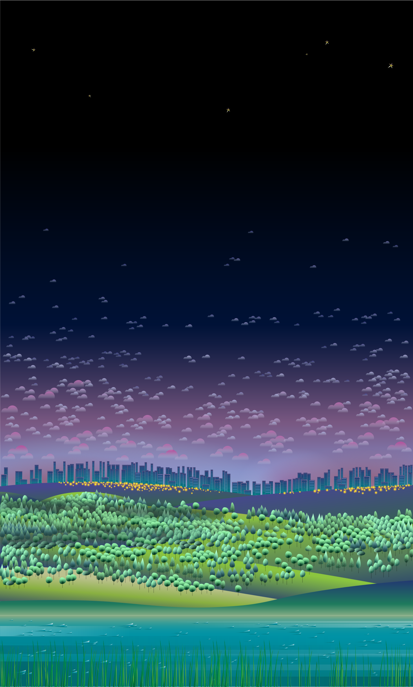

# Week 5 Reflection - [A View on Despair](https://www.studioterp.nl/a-view-on-despair-a-datavisualization-project-by-studio-terp/)

Not all visualizations represent some good or intriguing result. This one in particular is one of those red herrings. *A View on Despair* is a visualization that creates a landscape where each elements represents a person who committed suicide in the Netherlands within 2017. Trees represent strangulation, clouds are drugs/alcohol/medicine, yellow flowers are trains, waves are drowning, buildings are jumping, blades are some less used methods (poison, traffic accident, etc.), and stars are unknown. Each group is then split even further where the left side represents males while the right women. Each age group is also represented as a different element type such as different trees or different size clouds.

When each element represents a life that has given up, it becomes quite clear how many people die every year, not to mention the daily deaths around the world. Life is a precious thing that may or may not live on after death. This site's whole purpose was to outline the problems with systemic suicide within the country and to provide some links to resources to help those consider to give up their own.