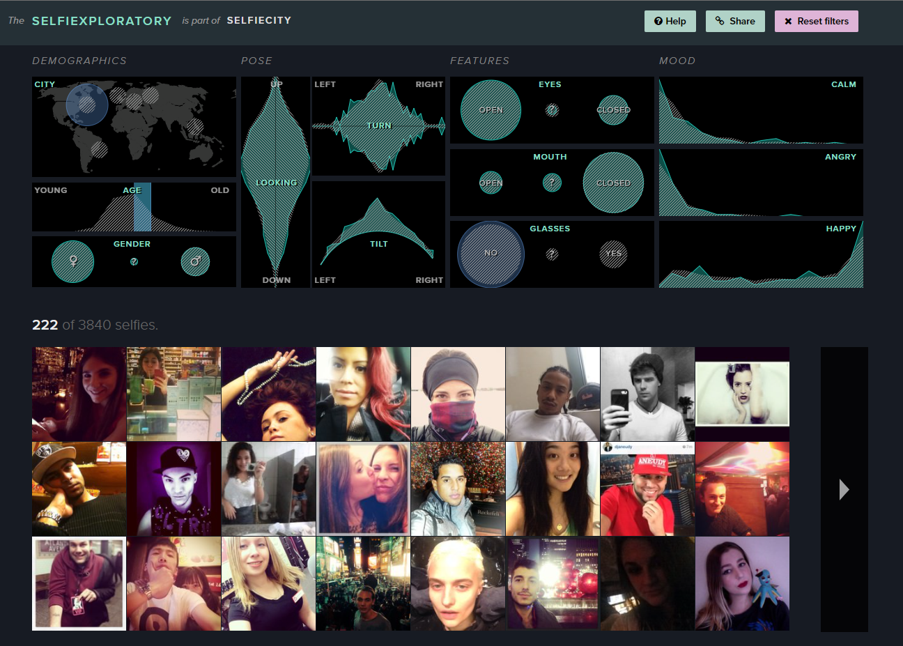

# Week 5 Reflection

Ryan LaMarche

Source: [http://selfiecity.net/selfiexploratory/](http://selfiecity.net/selfiexploratory/)

## Reflection

This is a project by The Graduate Center at CUNY, California Insitute for Technology, and the Andrew W. Mellon Foundation that investigated the style of selfie images in 5 cities around the world. They analyzed different feature sets over tens of thousands of images using automatic image analysis along with some manual work. Some of the aggregate findings are not very surprising, such as the median age of people taking selfies, and that a higher proportion of women take selfies compared to men. What I like about this project is the level of interaction in the visualization. The ability to filter the data and see live changes to the dataset and analyzed features is really interesting. This allows to person consuming this data to come to some of their own conclusions by exploring the data in different ways, and provides a much better experience than just giving aggregate statistics about the data such as medians and means. For example, in the selfies analyzed in Sao Paulo, the age was younger and they tilted their heads more than the selfies analyzed in New York City. I think this is a really interesting way to look at extracted feature sets from data that might be hard to visualize otherwise, such as images/selfies.
